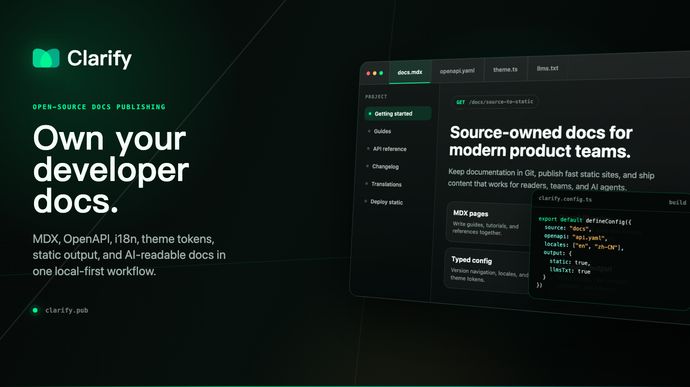
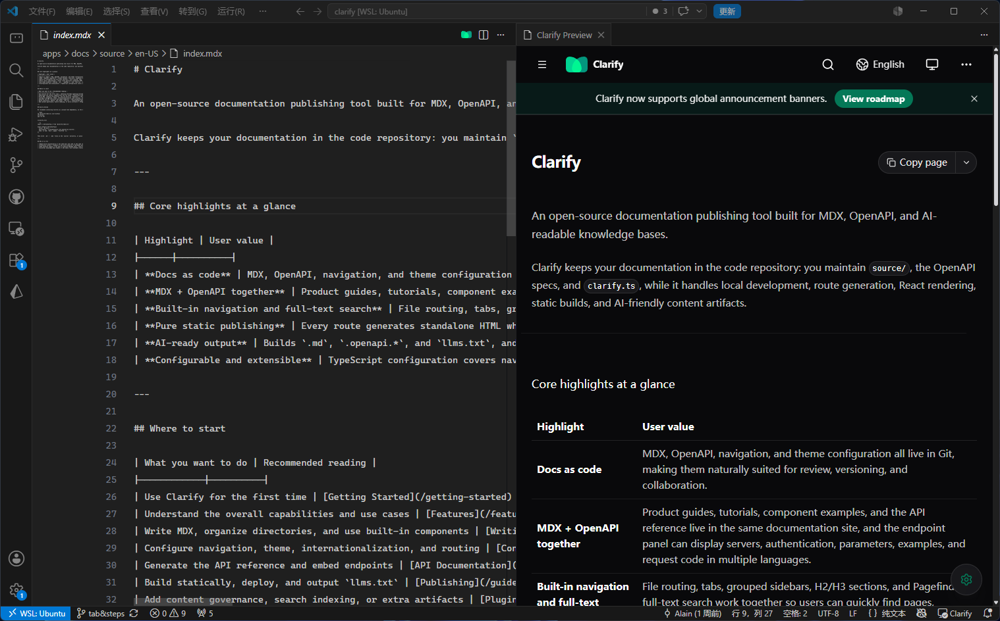

# Clarify

Ship a modern docs site from your own repository.

Clarify turns MDX, OpenAPI, and project content into a fast, multilingual, self-hostable documentation experience your team actually owns.

[中文版本](./README.zh-CN.md)

---



## Why teams choose Clarify

Clarify is built for teams that want polished docs without moving content into a hosted black box.

| Highlight | What you get |
|-----------|--------------|
| **Keep docs in your repo** | Version docs, API specs, navigation, and branding together with the product they describe. |
| **Publish guides and API docs together** | Put MDX pages, tutorials, changelogs, and generated OpenAPI references in one coherent site. |
| **Own the experience** | Self-host the output, customize the renderer, and keep deployment on infrastructure you control. |
| **Built for multilingual teams** | Organize localized content by locale and keep navigation, search, and raw content aligned by language. |
| **Search and AI readiness included** | Generate Pagefind indexes, raw content artifacts, and `llms.txt` without extra systems. |
| **Grow without switching tools** | Start with a local CLI, then extend with typed config, theme tokens, and plugins when you need more. |

## What Clarify helps you ship

With Clarify, you can publish:

- Product documentation that evolves with your codebase
- API references generated from OpenAPI 3.0 and 3.1 specs
- Internal engineering guides and team handbooks
- Multilingual help centers and developer portals
- AI-readable knowledge bases for agents and internal tooling

Clarify turns MDX content, OpenAPI specifications, and a typed `clarify.ts` configuration into a production-ready static documentation site.

## Built for teams that care about ownership

Most documentation tools optimize for convenience first. Clarify optimizes for long-term control.

- Your content stays in Git.
- Your docs build locally.
- Your output is static and portable.
- Your renderer is part of the codebase.
- Your team can customize without waiting on a hosted platform roadmap.

If you like the modern docs experience of tools like Mintlify, but want the source, rendering, and deployment model to stay under your control, Clarify is the fit.

## VSCode Extension

The Clarify VSCode extension provides live preview and instant navigation for your documentation projects directly in the editor.

### Features

- **Live Preview** — View your documentation with real-time hot module replacement as you edit MDX, OpenAPI specs, or config files.
- **Smart Navigation** — Automatically refresh the preview when switching between content files.
- **Integrated Dev Server** — Start, stop, and manage the Clarify dev server without leaving the editor.
- **Route Resolution** — Preview panel intelligently resolves the current route based on your open file.

### Installation

Download the latest `.vsix` extension package from the [GitHub Releases](https://github.com/taicode-labs/clarify/releases) page.

Then install it manually in VSCode:

```bash
code --install-extension clarify-vscode-extension-*.vsix
```

Or install through VSCode UI:

1. Open **Extensions** sidebar (`Ctrl+Shift+X` / `Cmd+Shift+X`)
2. Click the `...` menu at the top-right of the Extensions view
3. Select **Install from VSIX...**
4. Choose the downloaded `.vsix` file

### Usage

Once installed, the extension automatically detects Clarify projects (by the presence of `clarify.ts` in the workspace).

- Click the **Clarify icon** in the editor title bar to open the live preview panel
- The preview will auto-refresh when you edit and save content files
- Use **Clarify: Stop Dev Server** from the command palette to stop the background server



## Quick start

Start a new Clarify project:

```bash
npx @clarify-labs/cli init my-docs
cd my-docs
```

Then install dependencies and start the local site through the project script:

```bash
npm install
npm run dev
```

If your team uses pnpm or yarn, the generated `dev` script also works with `pnpm dev` or `yarn dev`.

## Create your first docs site

The starter includes a typed `clarify.ts` config, MDX pages, public assets, and scripts for local preview and production builds.

Add or edit pages in the generated content folder:

```text
source/
├── index.mdx
├── guides/
│   └── writing-content.mdx
└── api.openapi.json
```

Then build static output:

```bash
npm run build
```

The generated `output/` directory can be deployed to any static host.

## Core workflow

Use Clarify from the documentation project where your content lives:

```bash
npx clarify dev
npx clarify build
```

Configure navigation, OpenAPI references, theme tokens, locale behavior, and metadata in `clarify.ts`.

## What you get out of the box

- **MDX-first authoring** — Write Markdown, embed React components, use built-in callouts/cards/code blocks, and keep examples, guides, and reference pages in one content workflow.
- **OpenAPI documentation** — Render OpenAPI 3.0/3.1 specs as navigable API reference pages and embed individual operations inside MDX guides.
- **Project variables** — Define reusable project-wide content values once and reference them across pages and specs.
- **Static site generation** — Build deployable static output with one HTML file per route, client-side navigation, copied public assets, and route-prefix support.
- **Built-in internationalization** — Organize localized content by locale folders, configure locale fallback behavior, and localize navigation/footer labels in `clarify.ts`.
- **Built-in full-text search** — Generate and serve Pagefind indexes in both `clarify dev` and `clarify build`, with current-language results and highlighted excerpts.
- **Typed configuration** — Define tabs, sidebars, navbar links, footer links, theme tokens, route prefixes, favicon/logo variants, and metadata with TypeScript.
- **Themeable React renderer** — Customize a Tailwind CSS 4 + React 19 documentation shell with presets, color tokens, radius tokens, and layout width settings.
- **AI-ready output** — Generate raw `.md` / `.openapi.*` artifacts, page copy actions, stable raw-content links, and `llms.txt` for AI agents and developer tools.
- **Plugin-ready pipeline** — Extend route resolution, virtual modules, and build completion hooks for governance, translation workflows, or custom artifacts.
- **Local-first workflow** — Use `clarify dev` and `clarify build` in the repository where the docs live.

## A good fit if you want to

- Replace scattered Markdown folders with a polished docs site
- Publish product docs and API docs from the same repository
- Keep documentation review inside normal pull requests
- Self-host docs without giving up modern UX
- Prepare documentation for both humans and AI agents

## Why Clarify instead of Mintlify?

Mintlify is a polished hosted documentation platform. Clarify takes a different path: it is an open-source, codebase-owned publishing engine that keeps rendering, configuration, and deployment under your control.

| Area | Clarify | Mintlify |
|------|---------|----------|
| Ownership | Open-source project you can inspect, modify, and self-host | Hosted platform with product-level abstractions |
| Workflow | Local-first CLI: `clarify dev` and `clarify build` | Platform-oriented workflow around Mintlify conventions |
| Customization | React renderer, Tailwind styles, and typed config are part of the codebase | Easier defaults, but deeper customization depends on platform support |
| Deployment | Static output deployable to your own infrastructure | Typically centered on Mintlify hosting and integrations |
| OpenAPI | Built into the docs engine for local rendering and builds | Strong API docs support through the hosted platform |
| Internationalization | Native locale folders and fallback behavior | Depends on platform capabilities and configuration |
| Best fit | Teams that want open-source control, self-hosting, and code-level customization | Teams that prefer managed hosting and a turnkey docs product |

Clarify is not trying to clone Mintlify. It is for teams that like the modern docs experience Mintlify popularized, but want more ownership over the source, rendering layer, and deployment target.

## License

AGPL-3.0-only © 2026 Taicode Labs
