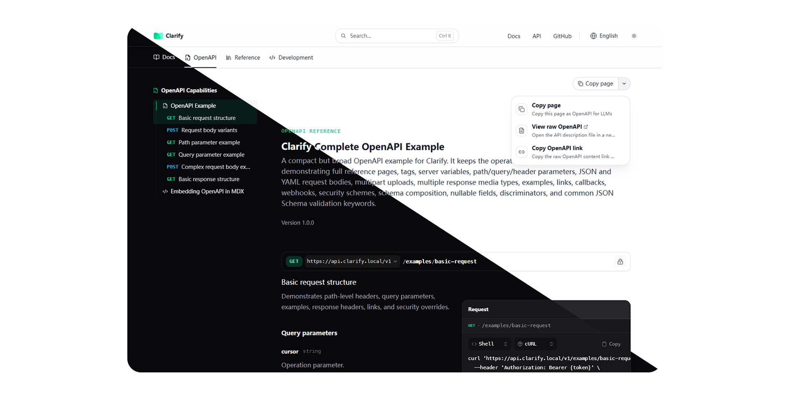

# Clarify

<p align="center">
  
</p>

<p align="center">
  <strong>面向 MDX、OpenAPI 与 AI 可读知识库的开源文档发布工具。</strong>
</p>

<p align="center">
  使用本地优先的 CLI 与完全可组合的 React 渲染器，构建快速、多语言、开发者友好的文档站点。
</p>

<p align="center">
  <a href="./README.md">🇬🇧 English Version</a>
</p>

---

<p align="center">
  
</p>

## 核心亮点

Clarify 面向希望拥有现代文档体验，同时保留源码、工作流和部署控制权的团队。

| 亮点 | 你能获得什么 |
|------|--------------|
| **文档和代码在一起** | MDX 页面、OpenAPI 规范、导航和主题配置都进入同一个仓库，方便 Review 和版本管理。 |
| **MDX + OpenAPI 一体化** | 教程、产品指南和自动生成的 API Reference 共用同一个站点，不需要额外文档产品。 |
| **纯静态、可自托管** | 构建独立 HTML、资源文件、public 文件、原始 Markdown/OpenAPI 产物和 `llms.txt`。 |
| **默认面向 AI 可读** | 暴露原始页面内容、原始接口规范和发现入口，方便 Agent、知识库和内部工具读取。 |
| **类型化、可扩展发布流程** | 用 TypeScript 配置导航、国际化、主题 token、页脚、部署子路径和构建插件。 |

## Clarify 是什么？

Clarify 是一个开源文档发布工具，适合希望文档与代码库一起演进的团队。它会将 MDX 内容、OpenAPI 规范和类型化的 `clarify.ts` 配置转换为可直接部署的静态文档站点。

它适用于产品文档、API 参考、工程手册，以及面向 AI Agent 和开发者工具的可读文档门户。重点是易于版本管理、易于定制，并且可以自托管。

## 核心功能

- **MDX 优先的写作体验** — 使用 Markdown 写文档，嵌入 React 组件，使用内置 Callout、Card 和代码块，并让教程、示例和参考页共享同一套内容工作流。
- **OpenAPI 文档生成** — 将 OpenAPI 3.0/3.1 规范渲染为可导航的 API 参考页面，也能在 MDX 指南中嵌入单个接口。
- **静态站点生成** — 为每个路由输出独立 HTML，支持客户端导航、public 资源复制和部署子路径。
- **内置国际化** — 通过 locale 目录组织多语言内容，并在 `clarify.ts` 中配置缺失翻译 fallback、导航和页脚本地化。
- **类型化配置** — 用 TypeScript 定义 Tabs、侧边栏、顶部导航、页脚链接、主题 token、部署子路径、favicon/logo 变体和元数据。
- **可主题化 React 渲染器** — 基于 Tailwind CSS 4 + React 19 的文档外壳支持主题预设、颜色 token、圆角 token 和布局宽度配置。
- **AI-ready 输出** — 生成原始 `.md` / `.openapi.*` 产物、页面复制操作、稳定原始内容链接和 `llms.txt`。
- **插件化构建管线** — 可扩展路由解析、虚拟模块和构建完成 Hook，用于内容治理、搜索索引、翻译流水线或自定义产物。
- **本地优先工作流** — 在文档所在仓库直接使用 `clarify dev` 与 `clarify build`。

## 为什么选择 Clarify，而不是 Mintlify？

Mintlify 是成熟的托管式文档平台。Clarify 选择了另一条路线：它是开源、代码库自有的发布引擎，让渲染层、配置和部署目标都掌握在团队自己手里。

| 维度 | Clarify | Mintlify |
|------|---------|----------|
| 所有权 | 开源，可审计、可修改、可自托管 | 托管平台，使用平台提供的产品抽象 |
| 工作流 | 本地优先 CLI：`clarify dev` 与 `clarify build` | 围绕 Mintlify 约定和平台能力组织 |
| 定制能力 | React 渲染器、Tailwind 样式和类型化配置都在代码库中 | 默认体验更开箱即用，深度定制取决于平台支持 |
| 部署方式 | 静态输出，可部署到自有基础设施 | 通常围绕 Mintlify 托管与集成展开 |
| OpenAPI | 文档引擎内置，可本地渲染与构建 | 通过托管平台提供成熟 API 文档能力 |
| 国际化 | 原生 locale 目录与 fallback 行为 | 取决于平台能力和具体配置 |
| 更适合 | 需要开源控制权、自托管、代码级定制的团队 | 偏好托管服务和一站式文档产品的团队 |

Clarify 并不是要复制 Mintlify。它面向的是喜欢现代文档体验，但希望拥有源码、渲染层和部署目标控制权的团队。

## 仓库结构

```
├── apps/
│   ├── docs/          # 文档 playground 与本地开发站点
│   └── www/           # 营销网站与落地页
├── packages/
│   ├── renderer/      # 共享 React 组件与 UI 基础组件
│   └── cli/           # Clarify CLI 与文档引擎
```

## 技术栈

- React 19 + TypeScript 5
- Tailwind CSS 4
- Clarify CLI 封装的 Vite 内核
- pnpm workspaces

## 快速开始

```bash
pnpm install
pnpm dev:docs
```

常用工作区命令：

```bash
pnpm dev:www
pnpm build
pnpm typecheck
pnpm lint
```

## 许可

AGPL-3.0-only © 2026 Taicode Labs
