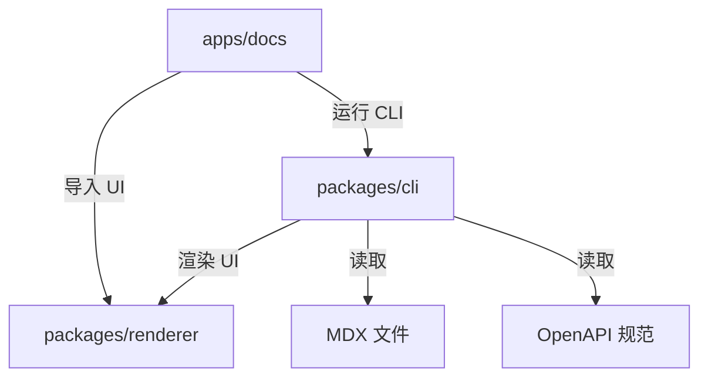

# 整体架构

Clarify 采用 Monorepo 结构组织，包含应用和包两个层级。

---

## Monorepo 结构

```
├── apps/
│   ├── docs/           # 文档游乐场 & 开发站点 (端口 5173)
│   └── www/            # 营销网站 & 落地页 (端口 5174)
├── packages/
│   ├── renderer/       # 共享 React 组件 & UI 原语
│   └── cli/            # Clarify CLI 与文档构建引擎
```

---

## 工作空间职责

### `apps/docs` — 文档游乐场

- **用途**：作为主要开发环境和 Clarify 引擎的实时示例
- **关键特性**：
  - 消费 `@clarify-labs/renderer` 获取 UI 组件
  - 通过 `@clarify-labs/cli` 进行 MDX/OpenAPI 编译、路由、开发服务器和静态构建
  - 为 CLI 和渲染器变更提供真实的测试环境
- **依赖**：`@clarify-labs/renderer` (workspace), `@clarify-labs/cli` (workspace)
- **构建输出**：作为官方文档部署的静态站点

### `apps/www` — 营销站点

- **用途**：Clarify 项目的公共落地页和营销内容
- **关键特性**：
  - 独立的 React + Tailwind CSS 应用程序
  - 展示特性、快速入门指南和社区链接
- **依赖**：不依赖 `packages/*`（保持独立以简化部署）
- **构建输出**：部署到项目公共域的静态站点

### `packages/renderer` — 共享 React 组件

- **用途**：提供文档引擎使用的 React 运行时、应用壳和内容组件
- **关键组件**：
  - `AppShell`：文档站点的顶级应用壳，负责路由、导航、搜索、主题切换和内容操作
  - `Navigation` / `Header`：桌面端侧边栏、移动端导航和顶部栏
  - `Code` / `CodeGroup` / `Prose`：MDX 内容的基础排版与代码块组件
  - `OpenApiPage` / `ApiEndpointCard`：用于渲染 OpenAPI 页面和接口卡片
- **分发**：使用 Vite library build 输出 ESM / CJS / DTS，以便 CLI 和用户项目消费
- **约束**：除 React / React Router 等 peer dependency 外，避免绑定具体应用；不要求用户维护渲染器入口

### `packages/cli` — Clarify CLI

- **用途**：将 MDX + OpenAPI 转换为可运行文档站点，并提供用户可直接使用的命令行入口
- **关键职责**：
  - **命令封装**：提供 `clarify dev`、`clarify build`、`clarify init`
  - **MDX 编译**：集成 `@mdx-js/rollup` 将 `.md` / `.mdx` 文件编译为 React 组件
  - **OpenAPI 摄取**：读取 `*.openapi.yaml/json`，使用 `@clarify-labs/renderer` 组件生成类型安全的 API 参考页面
  - **路由生成**：自动从文件系统生成路由清单（例如 `docs/getting-started.mdx` → `/getting-started`）
  - **开发服务器**：为内容和 API 规范变更提供热更新
  - **构建集成**：发出适合部署的静态预渲染站点
- **配置**：用户主要通过 `clarify.json` 和 CLI 参数自定义站点
- **分发**：发布为 `@clarify-labs/cli`，暴露 `clarify` bin

---

## 数据流



1. **作者**在 `source/content/` 中编写 MDX/Markdown 文档和 OpenAPI 规范
2. **`@clarify-labs/cli`**扫描内容目录，编译 MDX，摄取 OpenAPI，并生成路由
3. **`renderer`**组件被编译后的 MDX 和 CLI 生成的页面导入以渲染 UI
4. **CLI 内部构建管线**将所有内容打包为静态站点

---

## 依赖规则

| 方向 | 是否允许 | 说明 |
|------|----------|------|
| Apps → Packages | ✅ | 应用通过 `workspace:*` 依赖包 |
| Packages → Apps | ❌ | 包必须保持应用无关 |
| 跨包依赖 | ✅ | 在 `package.json` 中使用 `workspace:*`，在开发中使用 Vite `resolve.alias` |
| 外部依赖 | ✅ | 优先选择维护良好、轻量级的库。仅限 React 生态 |

---

## 技术栈

| 层级 | 技术 | 版本 | 理由 |
|------|------|------|------|
| 框架 | React | 19.x | 最新稳定版，并发特性，服务器组件就绪 |
| 样式 | Tailwind CSS | 4.x | 工具优先，最小 CSS 输出，设计系统友好 |
| CLI 内部构建工具 | Vite | 8.x | 快速 HMR，优化生产构建，作为实现细节封装在 CLI 内部 |
| 语言 | TypeScript | 5.x | 严格模式，出色的 DX，类型安全的 MDX/OpenAPI 摄取 |
| 包构建器 | tsup | 8.5.x | 包的快速 ESM/CJS + DTS 构建 |
| 包管理器 | pnpm | 9.x | Workspace 原生，确定性，磁盘高效 |
| Monorepo | pnpm workspaces | - | 简单，快速，无需额外工具 |

---

## 构建顺序与开发工作流

### 开发（无需预构建）

文档站点通过 `@clarify-labs/cli` 启动，普通用户无需维护构建工具配置。你可以运行：

```bash
pnpm dev:docs   # 启动文档游乐场
pnpm dev:www    # 启动营销站点
```

### 生产构建

```bash
pnpm build      # 构建所有包和应用
```
