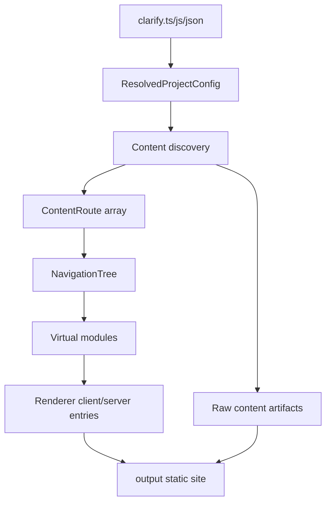

# Overall architecture

Clarify uses a Monorepo structure with two levels: apps and packages.

---

## Monorepo structure

<FileTree aria-label="Clarify monorepo structure">
  <FileTreeItem name="clarify" type="folder">
    <FileTreeItem name="apps" type="folder" description="port 5173">
      <FileTreeItem name="docs" description="Documentation playground & development site" />
      <FileTreeItem name="www" description="Marketing website & landing pages" />
    </FileTreeItem>
    <FileTreeItem name="packages" type="folder">
      <FileTreeItem name="renderer" description="Shared React components & UI primitives" />
      <FileTreeItem name="cli" description="Clarify CLI and documentation build engine" />
    </FileTreeItem>
  </FileTreeItem>
</FileTree>

---

## Workspace responsibilities

### `apps/docs` — documentation playground

- **Purpose**: Serves as the primary development environment and a live example of the Clarify engine.
- **Key features**:
  - Consumes `@clarify-labs/renderer` for UI components.
  - Uses `@clarify-labs/cli` for MDX/OpenAPI compilation, routing, development server, and static builds.
  - Provides a realistic test environment for CLI and renderer changes.
- **Dependencies**: `@clarify-labs/renderer` (workspace), `@clarify-labs/cli` (workspace)
- **Build output**: Static site deployed as the official documentation.

### `apps/www` — marketing site

- **Purpose**: Public landing pages and marketing content for the Clarify project.
- **Key features**:
  - Independent React + Tailwind CSS application.
  - Presents features, quick-start guides, and community links.
- **Dependencies**: Does not depend on `packages/*` (kept independent to simplify deployment).
- **Build output**: Static site deployed to the project's public domain.

### `packages/renderer` — shared React components

- **Purpose**: Provides the React runtime, app shell, and content components used by the documentation engine.
- **Key components**:
  - `AppShell`: The top-level app shell for documentation sites, responsible for routing, navigation, search, theme switching, and content actions.
  - `Navigation` / `Header`: Desktop sidebar, mobile navigation, and top bar.
  - `Code` / `CodeGroup` / `Prose`: Base typography and code block components for MDX content.
  - `OpenApiDocument` / `OpenApiOperation`: Used to render OpenAPI pages and embed single endpoints.
- **Distribution**: Uses Vite library build to output ESM / CJS / DTS for CLI and user projects.
- **Constraints**: Avoid binding to specific apps except for peer dependencies such as React / React Router; users should not need to maintain renderer entry points.

### `packages/cli` — Clarify CLI

- **Purpose**: Converts MDX + OpenAPI into a runnable documentation site and provides user-facing command-line entry points.
- **Key responsibilities**:
  - **Command wrapper**: Provides `clarify dev`, `clarify build`, and `clarify init`.
  - **MDX compilation**: Integrates `@mdx-js/rollup` to compile `.md` / `.mdx` files into React components.
  - **OpenAPI ingestion**: Reads `*.openapi.yaml/json` and uses `@clarify-labs/renderer` components to generate type-safe API reference pages.
  - **Route generation**: Automatically generates route manifests from the file system (for example, `docs/getting-started.mdx` → `/getting-started`).
  - **Development server**: Provides hot updates for content and API spec changes.
  - **Build integration**: Emits a statically prerendered site suitable for deployment.
- **Configuration**: Supports `clarify.ts`, `clarify.js`, and `clarify.json`; `clarify.ts` is recommended for type-safe configuration and plugins.
- **Distribution**: Published as `@clarify-labs/cli` and exposes the `clarify` bin.

---

## Data flow



1. **Authors** write MDX/Markdown documents and OpenAPI specifications in `source/`.
2. **`@clarify-labs/cli`** loads configuration, scans the content directory, parses MDX/OpenAPI, and generates `ContentRoute[]`.
3. **The CLI** generates `NavigationTree` from routes and `tabs` configuration, then passes the data to the renderer through virtual modules.
4. **`packages/renderer`** consumes `config`, `routes`, `navigation`, and `openApis` to render client and server entries.
5. **The SSG pipeline** outputs static HTML, JS/CSS assets, raw Markdown/OpenAPI artifacts, and `llms.txt`.

---

## System boundaries

| Boundary | Input | Output |
|----------|-------|--------|
| User project → CLI | `clarify.ts/js/json`, `source/`, `public/`, CLI arguments | Resolved configuration, route model, virtual modules, build artifacts |
| CLI → Renderer | `config`, `routes`, `navigation`, `openApis` | React app shell and pages |
| Build → Deploy | `output/` | Static HTML, assets, copied public files, raw content artifacts, `llms.txt` |

Do not put file system scanning or configuration loading into the Renderer; do not put component visual logic into the CLI unless it is expressed as a stable data model.

---

## Core data models

| Type | Owner | Purpose |
|------|-------|---------|
| `ResolvedProjectConfig` | CLI | Defaults for site title, description, path prefix, theme, navigation, footer, i18n, and tabs. |
| `ResolvedBuildOptions` | CLI | Content root directory, output directory, and SSG behavior. |
| `ContentRoute` | CLI → Renderer | A single renderable route with identity fields, `meta`, `module`, `source`, optional OpenAPI state, diagnostics, and generated `artifacts`. |
| `NavigationTree` | CLI → Renderer | Sidebar and tab navigation, localizable. |

---

## Routing and navigation model

Clarify derives routes from `rootDirectory` (default: `source`):

```txt
source/index.mdx              → /
source/getting-started.mdx    → /getting-started
source/guides/index.mdx       → /guides
source/api.openapi.json       → /api
```

Multilingual projects use locale directories. The default language has no language prefix, while non-default languages have a language prefix. When `i18n.missing` is `fallback`, missing translations reuse default-language content and are marked as fallback routes.

Navigation has two sources:

1. When `tabs` is not configured, the sidebar is generated from the file tree.
2. When `tabs` is configured, each tab has its own `pages`, which can use `FileTree` or explicit groups.

The Renderer does not infer navigation from the file system; it only consumes the `NavigationTree` generated by the CLI.

---

## Plugin model

Clarify's built-in capabilities such as OpenAPI, content artifacts, and the HTML shell are all connected through plugin hooks. The currently implemented hooks include:

| Hook | Purpose |
|------|---------|
| `routes:discover` | Add or modify routes during route discovery. |
| `routes:discovered` | Add metadata after route discovery, such as parsing OpenAPI. |
| `routes:resolved` | Modify final routes and navigation. |
| `modules:before` | Add or modify virtual modules before Vite consumes them. |
| `html:transform` | Transform the HTML shell and inject tags. |
| `dev:configureServer` | Add development server middleware. |
| `build:done` | Write additional artifacts after SSG. |

This model should continue to carry future extensions such as search indexes, analytics scripts, and AI translation, avoiding one-off special branches in the build pipeline.

---

## Dependency rules

| Direction | Allowed | Description |
|-----------|---------|-------------|
| Apps → Packages | ✅ | Apps depend on packages through `workspace:*` |
| Packages → Apps | ❌ | Packages must remain app-agnostic |
| Cross-package dependencies | ✅ | Use `workspace:*` in `package.json`, and use Vite `resolve.alias` during development |
| External dependencies | ✅ | Prefer well-maintained, lightweight libraries. Limited to the React ecosystem |

---

## Tech stack

| Layer | Technology | Version | Reason |
|-------|------------|---------|--------|
| Framework | React | 19.x | Latest stable version, concurrent features, server-component ready |
| Styling | Tailwind CSS | 4.x | Utility-first, minimal CSS output, design-system friendly |
| CLI internal build tool | Vite | 8.x | Fast HMR and optimized production builds, encapsulated as an internal CLI implementation detail |
| Language | TypeScript | 5.x | Strict mode, excellent DX, type-safe MDX/OpenAPI ingestion |
| Package builder | Vite library build | 8.x | Current package build scripts use `vite build` to output ESM / CJS / DTS |
| Package manager | pnpm | 9.x | Workspace-native, deterministic, disk-efficient |
| Monorepo | pnpm workspaces | - | Simple, fast, no extra tools required |

---

## Build order and development workflow

### Development (no prebuild required)

The documentation site is started through `@clarify-labs/cli`; regular users do not need to maintain build-tool configuration. You can run:

```bash
pnpm dev:docs   # Start the documentation playground
pnpm dev:www    # Start the marketing site
```

### Production build

```bash
pnpm build      # Build all packages and apps
```
