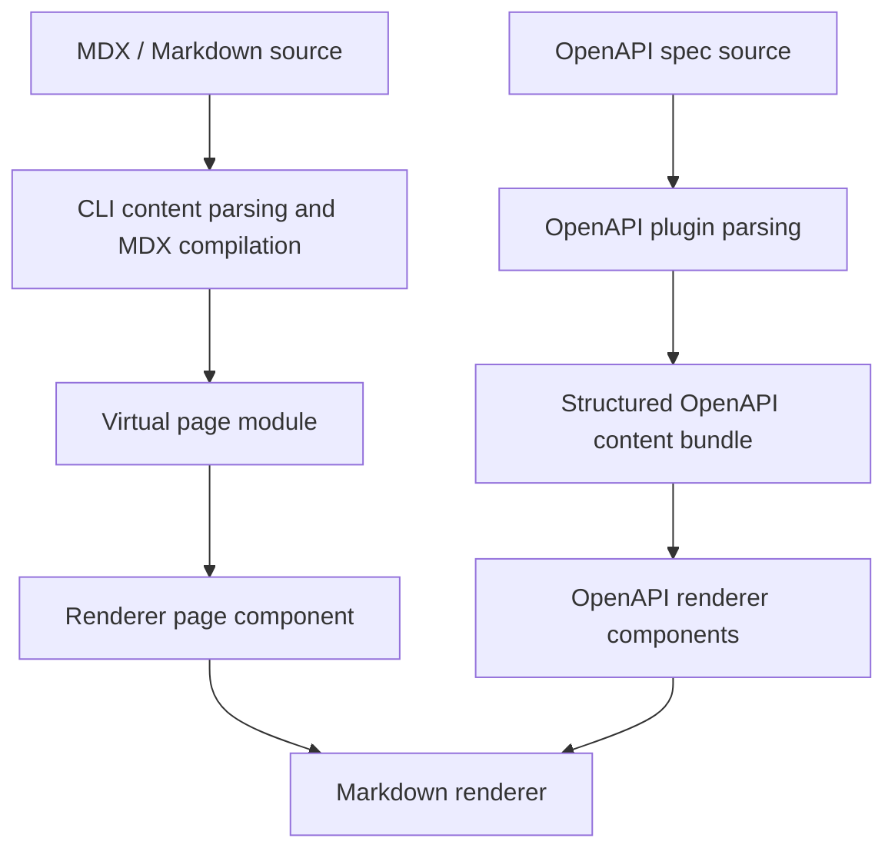
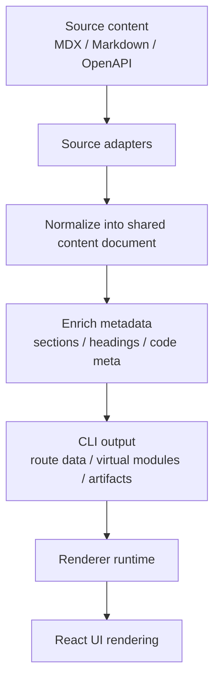

# Unified content pipeline architecture

Status: proposed design

Clarify currently receives content from several different sources: MDX documents, Markdown fragments, OpenAPI descriptions, and potentially future content types. The goal of this design is to make all of them pass through a shared content pipeline so that content semantics are normalized once, while the renderer remains responsible for final presentation.

---

## Current implementation state

At the moment, the repository already splits the two main content paths:

- MDX and Markdown page content are discovered and compiled in the CLI pipeline through [packages/cli/source/parsers/routes.ts](packages/cli/source/parsers/routes.ts), [packages/cli/source/parsers/mdx.ts](packages/cli/source/parsers/mdx.ts), and [packages/cli/source/core/plugin.ts](packages/cli/source/core/plugin.ts).
- OpenAPI descriptions are parsed by the OpenAPI plugin in [packages/cli/source/plugins/openapi/index.ts](packages/cli/source/plugins/openapi/index.ts) and [packages/cli/source/plugins/openapi/parser.ts](packages/cli/source/plugins/openapi/parser.ts), then rendered by the renderer entry points in [packages/renderer/source/openapi/entry.tsx](packages/renderer/source/openapi/entry.tsx) and [packages/renderer/source/openapi/components/EndpointSections.tsx](packages/renderer/source/openapi/components/EndpointSections.tsx).

The current implementation therefore has two different entry points for content normalization:



The common part is that both paths eventually rely on the shared markdown renderer in [packages/renderer/source/mdx/Markdown.tsx](packages/renderer/source/mdx/Markdown.tsx) and [packages/renderer/source/mdx/remark.ts](packages/renderer/source/mdx/remark.ts). The difference is that MDX content is normalized earlier in the CLI pipeline, while OpenAPI descriptions are prepared and consumed later in the renderer path.

---

## Why this design exists

Today, the system already has two different ways of handling text content:

- MDX pages are compiled in the CLI pipeline.
- Markdown fragments such as OpenAPI descriptions are rendered later by the renderer.

That works, but it causes two related problems:

1. Markdown handling is split across multiple layers.
2. It is hard to add new content-aware features in a consistent way.

The proposed architecture solves that by introducing a shared content model that can represent:

- page content
- markdown fragments
- OpenAPI descriptions
- future content types that want to reuse the same rendering pipeline

---

## Goals

The design should:

- normalize all text-based content through one shared pipeline
- keep the CLI responsible for content preparation and metadata generation
- keep the renderer responsible for presentation, styling, and interaction
- preserve support for MDX components and rich document features
- make OpenAPI descriptions render with the same formatting capabilities as MDX content
- leave room for future content types without introducing one-off parsing paths

## Non-goals

This design does not aim to:

- move all UI behavior into the CLI
- replace React and the renderer runtime
- make every content type behave exactly the same at the component level

---

## Core design principles

### 1. Content semantics first

If a feature describes content meaning, structure, or metadata, it belongs to the content layer. Examples include headings, lists, tables, code blocks, links, and section metadata.

### 2. Presentation stays in the renderer

If a feature changes how content looks or behaves in the browser, it belongs to the renderer. Examples include typography, theme-aware styling, interaction, hydration, and client-only behavior.

### 3. One normalized intermediate representation

All supported content sources should be converted into a shared intermediate representation before rendering. This representation should preserve semantic structure without committing to a final UI format.

### 4. Progressive migration over big-bang rewrites

The implementation should migrate step by step, keeping existing behavior intact while gradually routing more content paths through the shared model.

---

## Proposed intermediate representation

A more direct approach is to make the body of the content document itself a JSX fragment. In other words, instead of forcing content into a predefined node union and then reconstructing it later, the pipeline can first normalize content into a composable JSX representation.

```ts
type ContentDocument = {
  title?: string
  source?: string
  content: JSX.Element
  metadata: {
    sections?: Array<{ id?: string; title: string; level: number }>
    language?: string
  }
}
```

This has several advantages:

- the structure is simpler and easier to read
- title, source, content, and metadata are clearly separated
- the main body and the auxiliary information are distinguished explicitly
- future extensions can be added in metadata instead of turning the model into a large catch-all object

In short, the body is not a collection of synthetic nodes; it is a renderable JSX fragment. The difference between MDX, Markdown, and OpenAPI lies in what the content contains and in the attached metadata, not in a separate kind field on the document itself.

---

## Architecture overview



### Responsibilities

| Layer | Responsibility |
|---|---|
| Source adapters | Parse content from MDX, Markdown, or OpenAPI into a common document model |
| Normalization | Convert source-specific syntax into shared JSX content fragments |
| Enrichment | Add metadata used for routing, search, anchors, diagnostics, and content artifacts |
| Renderer | Convert the normalized document into final UI using React components |

---

## How each content type fits

### MDX pages

MDX pages should still be compiled in the CLI pipeline, but the resulting content should be represented as a normalized content document before it reaches the renderer. This lets the renderer consume a consistent structure for page content while still preserving component nodes.

### Markdown fragments

Embedded markdown fragments such as OpenAPI descriptions should use the same normalization path as MDX content. The difference is only in the source adapter, not in the rendering contract.

### OpenAPI descriptions

OpenAPI descriptions are source data, not UI components. Their Markdown content should be normalized through the shared pipeline, then handed to the renderer as content nodes. This guarantees that descriptions support the same formatting features as MDX content.

### Preprocessing OpenAPI into JSX

For OpenAPI, the most practical approach is not to parse Markdown again at runtime, but to preprocess description fields in the CLI pipeline so they already become JSX content before the renderer sees them.

The implementation path can be:

1. During OpenAPI parsing in the CLI, walk the spec and identify content-bearing fields such as `info.description`, `paths.*.*.description`, `parameters.description`, `requestBody.description`, `responses.*.description`, and `schema.description`.
2. For each string value, run the shared Markdown normalization pipeline and produce a JSX-compatible fragment instead of raw HTML.
3. Keep the original OpenAPI spec intact and attach the preprocessed content to a parallel content bundle used by the route renderer.
4. Let the renderer consume that preprocessed `content` directly, rather than reparsing the description text at runtime.

A minimal shape for that bundle can be:

```ts
type OpenAPIContentBlock = {
  content: JSX.Element
  metadata: {
    source: 'openapi-description'
    language?: string
  }
}
```

This gives us several benefits:

- OpenAPI descriptions can share the same “content is already normalized” model as MDX content
- the renderer no longer needs to parse Markdown again at runtime
- future components such as Callout, CodeGroup, or Mermaid can be attached directly to the preprocessed content
- the original OpenAPI spec remains available for artifact generation and other tooling

The natural implementation entry points are [packages/cli/source/plugins/openapi/parser.ts](packages/cli/source/plugins/openapi/parser.ts) and [packages/cli/source/plugins/openapi/index.ts](packages/cli/source/plugins/openapi/index.ts), followed by [packages/renderer/source/openapi/entry.tsx](packages/renderer/source/openapi/entry.tsx) as the consumer.

### Future content types

Any future content source can follow the same pattern:

1. add a source adapter
2. normalize into the shared content document
3. let the renderer render it through the same runtime contract

---

## Integration plan

### Phase 1: introduce the shared model

- define the shared content document types
- create a small shared parser module for markdown normalization
- keep the current renderer API working through a compatibility layer

### Phase 2: route OpenAPI descriptions through the shared model

- parse OpenAPI descriptions through the shared markdown normalization path
- keep the existing OpenAPI data structure intact
- render descriptions through the unified renderer entry point

### Phase 3: unify MDX page content handling

- make MDX page compilation produce the shared content document as part of the pipeline
- let the renderer consume that document instead of relying on multiple ad-hoc paths

### Phase 4: expand to future content types

- add additional source adapters as needed
- keep the renderer contract stable

---

## Renderer contract

The renderer should consume one stable contract:

```ts
function renderContentDocument(document: ContentDocument, context: RenderContext): ReactNode
```

The renderer decides:

- how the JSX body is mapped to the final UI structure
- how components such as `Callout`, `CodeGroup`, or `Mermaid` are rendered
- how theme, locale, and interactive behavior are applied

This keeps the renderer flexible without forcing it to become a parser for every source format.

---

## Migration strategy

A safe migration should avoid breaking existing content and UI behavior.

1. Keep the current Markdown component as a compatibility wrapper.
2. Introduce the shared content document types and parser behind the scenes.
3. Update OpenAPI descriptions to use the shared path first.
4. Move MDX content paths onto the same contract next.
5. Remove duplicate parsing logic only after the new path is verified.

---

## Risks and tradeoffs

### Risk: over-normalizing too early

If the shared model becomes too abstract, it can become hard to maintain. The model should stay close to the semantic structure of Markdown and MDX, not try to become a full UI abstraction.

### Risk: component support becomes ambiguous

MDX pages can contain custom components. The solution is to keep component nodes in the content tree so that the renderer can resolve them explicitly.

### Risk: build-time and runtime responsibilities drift

The CLI should prepare content and metadata. The renderer should render. If a feature needs browser context, it should stay in the renderer even if it originates from content data.

---

## Decision summary

The best long-term architecture is not to make the CLI render HTML and not to make the renderer parse every source format independently. The best architecture is:

- CLI/content pipeline: normalize content into a shared document model
- renderer: render that model into the final UI

This approach keeps content semantics centralized, preserves flexibility for MDX and OpenAPI, and gives future content types a clear path forward.
