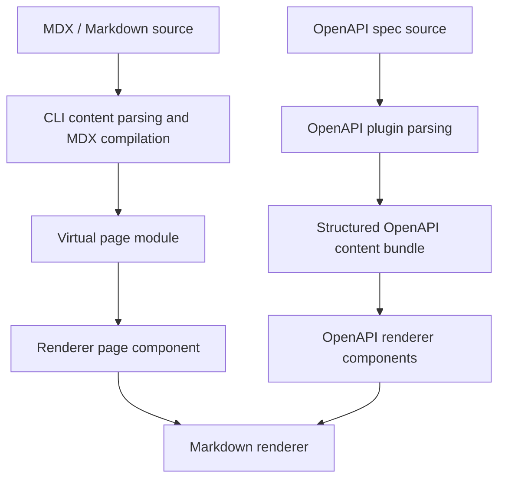
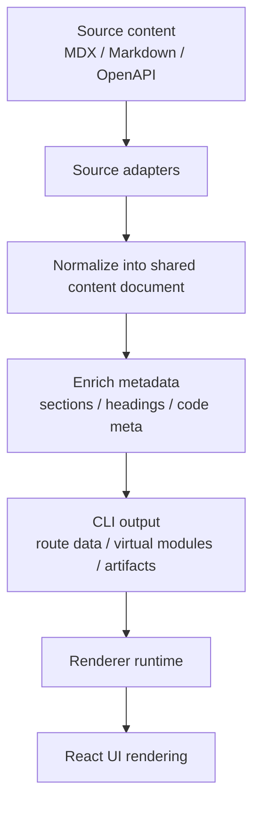

# Unified content pipeline architecture

Status: proposed design

Clarify currently receives content from several different sources: MDX documents, Markdown fragments, OpenAPI descriptions, and potentially future content types. The goal of this design is to make all of them pass through a shared content pipeline so that content semantics are normalized once, while the renderer remains responsible for final presentation.

---

## Current implementation state

At the moment, the repository already splits the two main content paths:

- MDX and Markdown page content are discovered and compiled in the CLI pipeline through [packages/cli/source/parsers/routes.ts](packages/cli/source/parsers/routes.ts), [packages/cli/source/parsers/mdx.ts](packages/cli/source/parsers/mdx.ts), and [packages/cli/source/core/plugin.ts](packages/cli/source/core/plugin.ts).
- OpenAPI descriptions are parsed by the OpenAPI plugin in [packages/cli/source/plugins/openapi/index.ts](packages/cli/source/plugins/openapi/index.ts) and [packages/cli/source/plugins/openapi/parser.ts](packages/cli/source/plugins/openapi/parser.ts), then rendered by the renderer entry points in [packages/renderer/source/openapi/entry.tsx](packages/renderer/source/openapi/entry.tsx) and [packages/renderer/source/openapi/components/EndpointSections.tsx](packages/renderer/source/openapi/components/EndpointSections.tsx).

The current implementation therefore has two different entry points for content normalization:



The common part is that both paths eventually rely on the shared markdown renderer in [packages/renderer/source/mdx/Markdown.tsx](packages/renderer/source/mdx/Markdown.tsx) and [packages/renderer/source/mdx/remark.ts](packages/renderer/source/mdx/remark.ts). The difference is that MDX content is normalized earlier in the CLI pipeline, while OpenAPI descriptions are prepared and consumed later in the renderer path.

---

## Why this design exists

Today, the system already has two different ways of handling text content:

- MDX pages are compiled in the CLI pipeline.
- Markdown fragments such as OpenAPI descriptions are rendered later by the renderer.

That works, but it causes two related problems:

1. Markdown handling is split across multiple layers.
2. It is hard to add new content-aware features in a consistent way.

The proposed architecture solves that by introducing a shared content model that can represent:

- page content
- markdown fragments
- OpenAPI descriptions
- future content types that want to reuse the same rendering pipeline

---

## Goals

The design should:

- normalize all text-based content through one shared pipeline
- keep the CLI responsible for content preparation and metadata generation
- keep the renderer responsible for presentation, styling, and interaction
- preserve support for MDX components and rich document features
- make OpenAPI descriptions render with the same formatting capabilities as MDX content
- leave room for future content types without introducing one-off parsing paths

## Non-goals

This design does not aim to:

- move all UI behavior into the CLI
- replace React and the renderer runtime
- make every content type behave exactly the same at the component level

---

## Core design principles

### 1. Content semantics first

If a feature describes content meaning, structure, or metadata, it belongs to the content layer. Examples include headings, lists, tables, code blocks, links, and section metadata.

### 2. Presentation stays in the renderer

If a feature changes how content looks or behaves in the browser, it belongs to the renderer. Examples include typography, theme-aware styling, interaction, hydration, and client-only behavior.

### 3. One normalized intermediate representation

All supported content sources should be converted into a shared intermediate representation before rendering. This representation should preserve semantic structure without committing to a final UI format.

### 4. Progressive migration over big-bang rewrites

The implementation should migrate step by step, keeping existing behavior intact while gradually routing more content paths through the shared model.

---

## CLI and renderer boundary

The boundary between the CLI and the renderer should be cut at a typed content-block contract.

The CLI focuses on content preparation and information extraction. It owns source discovery, route resolution, frontmatter parsing, OpenAPI spec loading, data parsing, diagnostics, metadata extraction, and artifact generation. It can parse source data to understand routes, titles, sections, headings, OpenAPI operations, and search/navigation facts. It should not perform any presentation rendering.

The renderer owns all rendering behavior. It decides how Markdown becomes React UI, how an OpenAPI operation is displayed, how OpenAPI description Markdown is rendered in parameters and responses, how custom MDX components are resolved, and how theme, locale, hydration, and client-side interaction are applied.

That means the data passed between the two layers should stay close to source content and extracted facts:

| Category | Owned by | Shape | Purpose |
|---|---|---|---|
| Content blocks | CLI | `Content[]` with `kind` values such as `markdown` and `openapi` | Describe what should appear on the page without saying how it should be rendered |
| Extracted metadata | CLI | route, title, sections, locale, source references, OpenAPI pointers | Support routing, navigation, search, diagnostics, and static artifacts |
| Presentation implementation | Renderer | React components, Markdown renderer, OpenAPI renderer, hooks | Turn content blocks into final UI, theme, layout, and interaction |

The important rule is: the CLI may parse data, but it must not render it. The renderer may render rich content, but it should not rediscover source files or rebuild route-level facts that the CLI already prepared.

This split gives each side a clear responsibility:

- The CLI prepares content blocks and facts about those blocks.
- The renderer dispatches each block by `kind` and turns it into UI.
- The bundler connects compiled modules when MDX execution is required, but presentation still belongs to the renderer.

---

## Proposed intermediate representation

The shared intermediate representation should be a document made of typed content blocks. It should not require a synthetic content AST, and it should not pre-render Markdown into HTML or JSX. The model describes what content exists; the renderer decides how each block appears.

```ts
type ContentDocument = {
  id: string
  title?: string
  source?: string
  content: Content[]
  metadata: ContentMetadata
}

type Content = MarkdownContent | OpenAPIContent

type MarkdownContent = {
  kind: 'markdown'
  value: string
  source?: ContentSource
}

type OpenAPIContent = {
  kind: 'openapi'
  spec: OpenAPISpecReference
  operation?: OpenAPIOperationReference
  source?: ContentSource
}

type ContentMetadata = {
  sections?: Array<{ id?: string; title: string; level: number }>
  language?: string
}
```

This has several advantages:

- the document body is simple and ordered
- each block clearly states what kind of content it contains
- Markdown content stays as Markdown until the renderer renders it
- OpenAPI content stays as OpenAPI data or references until the renderer renders it
- future content types can add new `kind` values without turning the model into a large catch-all object

In short, `ContentDocument.content` is the cut between the CLI and the renderer. The CLI assembles typed blocks and extracts useful metadata. The renderer owns the Markdown renderer, OpenAPI renderer, and any React-specific presentation logic.

---

## Architecture overview



### Responsibilities

| Layer | Responsibility |
|---|---|
| Source adapters | Load content from MDX, Markdown, or OpenAPI sources into typed content blocks |
| Data parsing | Extract route, section, OpenAPI operation, source-reference, search, and diagnostic facts |
| Enrichment | Add metadata used for routing, search, anchors, diagnostics, and content artifacts |
| Renderer | Convert the normalized document into final UI using React components |

---

## How each content type fits

### MDX pages

MDX pages should still be compiled in the CLI pipeline, but the resulting content should be represented as a normalized content document before it reaches the renderer. This lets the renderer consume a consistent structure for page content while still preserving component nodes.

### Markdown fragments

Embedded markdown fragments such as OpenAPI descriptions should use the same normalization path as MDX content. The difference is only in the source adapter, not in the rendering contract.

### OpenAPI descriptions

OpenAPI descriptions are source data, not UI components. Their Markdown should remain Markdown strings in the OpenAPI data model or in extracted content blocks. The renderer should render those strings through the shared Markdown renderer wherever descriptions appear.

### Preparing OpenAPI content blocks

For OpenAPI, the most practical approach is to let the CLI prepare spec references and extracted metadata, while leaving Markdown rendering to the renderer.

The implementation path can be:

1. During OpenAPI parsing in the CLI, load and validate the spec, resolve route-level operation targets, and collect metadata such as tags, operation ids, sections, and source pointers.
2. Keep the original OpenAPI spec intact, including Markdown description strings in `info.description`, `paths.*.*.description`, `parameters.description`, `requestBody.description`, `responses.*.description`, and `schema.description`.
3. Emit an `openapi` content block that points at the spec and, when needed, at a specific operation.
4. Let the renderer render the OpenAPI block and call the shared Markdown renderer at every description display point.

A minimal shape for that bundle can be:

```ts
type OpenAPIContentBlock = {
  kind: 'openapi'
  spec: OpenAPISpecReference
  operation?: OpenAPIOperationReference
  source?: ContentSource
}
```

This gives us several benefits:

- OpenAPI descriptions can share the same “content is already normalized” model as MDX content
- every OpenAPI description field is rendered through the same Markdown component at the point of display
- future components such as Callout, CodeGroup, or Mermaid can be supported in one renderer-owned Markdown path
- the original OpenAPI spec remains available for artifact generation and other tooling

The natural implementation entry points are [packages/cli/source/plugins/openapi/parser.ts](packages/cli/source/plugins/openapi/parser.ts) and [packages/cli/source/plugins/openapi/index.ts](packages/cli/source/plugins/openapi/index.ts), followed by [packages/renderer/source/openapi/entry.tsx](packages/renderer/source/openapi/entry.tsx) as the consumer.

### Future content types

Any future content source can follow the same pattern:

1. add a source adapter
2. normalize into the shared content document
3. let the renderer render it through the same runtime contract

---

## Evaluation

The proposal is directionally strong because it addresses a real architectural split: MDX content and OpenAPI Markdown descriptions currently enter the system through different normalization paths, even though both ultimately depend on the same Markdown rendering behavior.

The main tradeoff is that this model keeps the CLI simpler and renderer-agnostic, but it also moves more rendering responsibility into the renderer. That is the right boundary for Clarify: the CLI can parse data and extract facts, while the renderer owns all Markdown and OpenAPI presentation behavior.

### Strengths

- It creates one conceptual content pipeline instead of maintaining separate Markdown behavior for MDX pages and OpenAPI descriptions.
- It keeps the existing CLI / renderer boundary mostly intact: the CLI prepares content and metadata, while the renderer keeps control over UI, theme, hydration, and interaction.
- It makes OpenAPI descriptions more capable. Today they are Markdown strings rendered inside OpenAPI components; the proposed path lets them share richer content behavior with MDX pages.
- It improves future extensibility. New content sources can be added through source adapters instead of each source inventing its own parsing and rendering path.
- It gives content-aware features a better home. Features such as section extraction, code metadata, search artifacts, and diagnostics can be computed from one normalized content model.
- It naturally supports embedding OpenAPI content inside MDX pages because both Markdown and OpenAPI are just ordered content blocks.
- It avoids coupling the CLI to React, JSX, or renderer-specific Markdown behavior.

### Weaknesses

- Runtime Markdown rendering may cost more than build-time preprocessing if large pages contain many Markdown fragments. The renderer may need caching if this becomes measurable.
- Search, table of contents, and section extraction still need CLI-side parsing. That parsing is allowed, but it must remain information extraction rather than presentation rendering.
- Some Markdown rendering errors will move from build time to renderer time unless the CLI also runs non-rendering validation checks.
- The proposal may overstate how much MDX and OpenAPI can share. MDX is authored as executable component-rich content, while OpenAPI descriptions are data fields embedded in a schema. They should share Markdown semantics, but not necessarily the same full document contract.
- Security and component scope need explicit rules. OpenAPI descriptions should probably support Markdown, Mermaid, and code formatting, but not arbitrary MDX component execution unless that is a deliberate product decision.

### Architectural concern

The largest concern is accidentally moving rendering back into the CLI under the name of “normalization.” The CLI can parse Markdown and OpenAPI data to extract headings, sections, operation ids, search text, diagnostics, and source references. It should not convert those inputs into UI-specific React trees, HTML, or renderer-owned component structures.

A safer framing is to keep the document model block-based:

```ts
type ContentDocument = {
  content: Content[]
  metadata: ContentMetadata
}

type Content = MarkdownContent | OpenAPIContent
```

In that model, `markdown` blocks keep Markdown as source text, and `openapi` blocks keep OpenAPI data or references. The renderer then owns the mapping from each block kind to React UI.

### Recommended adjustment

The recommended version of this proposal is:

1. Introduce `ContentDocument.content: Content[]` as the shared contract.
2. Keep Markdown rendering in the renderer, including Markdown that currently gets partially handled in the CLI path.
3. Let the CLI parse content for information extraction only: route data, headings, sections, search text, OpenAPI metadata, diagnostics, and source references.
4. Render OpenAPI descriptions in the renderer at each display point using the shared Markdown renderer.
5. Treat MDX pages and embedded OpenAPI blocks as ordered content blocks so the same OpenAPI renderer works in route pages and inside MDX pages.

With that adjustment, the design keeps its main benefit: unified Markdown and OpenAPI rendering semantics. It also keeps the CLI focused on preparation and extraction instead of presentation.

---

## Integration plan

### Implementation task breakdown

The refactor can be tracked as a sequence of small compatibility-preserving tasks:

1. Add the shared content document types and expose them from the renderer package.
2. Attach the optional content document contract to CLI routes without changing existing rendering behavior.
3. Make OpenAPI route generation emit an `openapi` content block alongside the current route data.
4. Add a renderer-side content document dispatcher that maps block kinds to existing Markdown and OpenAPI components.
5. Route OpenAPI pages through the dispatcher while keeping the current direct component API as a compatibility layer.
6. Move MDX page route data onto the same document shape, preserving MDX compilation and component resolution in the renderer/bundler path.
7. Remove duplicate route-specific rendering paths after both OpenAPI and MDX pages are covered by tests.

### Phase 1: introduce the shared model

- define the shared content document types
- define the first `Content` kinds: `markdown` and `openapi`
- keep the current renderer API working through a compatibility layer

### Phase 2: route OpenAPI descriptions through the shared model

- keep the existing OpenAPI data structure intact
- render OpenAPI description fields through the shared renderer-owned Markdown component
- make sure `info.description`, operation descriptions, parameter descriptions, request body descriptions, response descriptions, and schema/property descriptions all use the same path

### Phase 3: unify MDX page content handling

- make MDX page discovery produce a shared content document with ordered content blocks
- represent embedded OpenAPI operations as `openapi` blocks or renderer components that consume the same OpenAPI renderer
- keep MDX compilation as a bundler/runtime concern, not as CLI-owned presentation rendering

### Phase 4: expand to future content types

- add additional source adapters as needed
- keep the renderer contract stable

---

## Renderer contract

The renderer should consume one stable contract:

```ts
function renderContentDocument(document: ContentDocument, context: RenderContext): ReactNode
```

The renderer decides:

- how each `Content.kind` is mapped to the final UI structure
- how Markdown strings are parsed and rendered
- how OpenAPI blocks are rendered
- how components such as `Callout`, `CodeGroup`, or `Mermaid` are rendered
- how theme, locale, and interactive behavior are applied

This keeps the renderer flexible without forcing the CLI to own presentation rendering.

---

## Migration strategy

A safe migration should avoid breaking existing content and UI behavior.

1. Keep the current Markdown component as a compatibility wrapper.
2. Introduce the shared content document and `Content[]` block types behind the scenes.
3. Update OpenAPI pages to render from `openapi` blocks first.
4. Move MDX page content onto the same ordered block contract next.
5. Remove duplicate rendering logic only after the renderer-owned path is verified.

---

## Risks and tradeoffs

### Risk: over-normalizing too early

If the shared model becomes too abstract, it can become hard to maintain. The model should stay close to source content blocks, not try to become a full UI abstraction or synthetic Markdown AST.

### Risk: component support becomes ambiguous

MDX pages can contain custom components. The solution is to keep MDX execution and component resolution in the renderer/bundler path, while representing structured embedded content such as OpenAPI operations as explicit content blocks.

### Risk: build-time and runtime responsibilities drift

The CLI should prepare content, parse data, and extract metadata. The renderer should render. If a feature creates UI, depends on browser context, or maps Markdown/OpenAPI data to React components, it should stay in the renderer even if it originates from content data.

---

## Decision summary

The best long-term architecture is not to make the CLI render HTML, JSX, or Markdown UI. The best architecture is:

- CLI/content pipeline: prepare typed content blocks and extract route/search/navigation facts
- renderer: render those content blocks into the final UI

This approach keeps source parsing and information extraction centralized, preserves flexibility for MDX and OpenAPI, and gives future content types a clear path forward.
