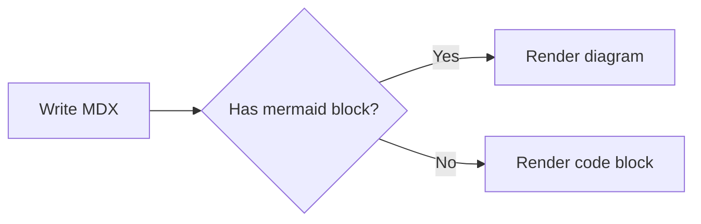

# Writing Content

This page brings together the core capabilities related to "writing content" in Clarify: MDX, frontmatter, file routing, OpenAPI file routing, code blocks, and built-in components.

The goal is to let authors know: where files should go, how pages are generated, how to write metadata, and when to use components.

---

## Recommended directory structure

Organize docs by reader tasks rather than by internal modules:

<FileTree aria-label="Recommended documentation structure">
  <FileTreeItem name="source" type="folder">
    <FileTreeItem name="index.md" />
    <FileTreeItem name="getting-started.md" />
    <FileTreeItem name="guides" type="folder">
      <FileTreeItem name="writing.md" />
      <FileTreeItem name="deploy.mdx" />
    </FileTreeItem>
    <FileTreeItem name="reference" type="folder">
      <FileTreeItem name="config.mdx" />
    </FileTreeItem>
    <FileTreeItem name="api.openapi.json" />
  </FileTreeItem>
</FileTree>

When internationalization is enabled, place the same structure inside locale directories:

<FileTree aria-label="Localized documentation structure">
  <FileTreeItem name="source" type="folder">
    <FileTreeItem name="zh-CN" type="folder">
      <FileTreeItem name="index.md" />
      <FileTreeItem name="getting-started.mdx" />
    </FileTreeItem>
    <FileTreeItem name="en-US" type="folder">
      <FileTreeItem name="index.md" />
      <FileTreeItem name="getting-started.mdx" />
    </FileTreeItem>
  </FileTreeItem>
</FileTree>

---

## Files are routes

Clarify generates page paths from the file structure under `source/`:

| File | Route |
|------|------|
| `source/index.md` | `/` |
| `source/getting-started.md` | `/getting-started` |
| `source/guides/index.md` | `/guides` |
| `source/guides/auth.mdx` | `/guides/auth` |
| `source/api.openapi.json` | `/api` |

Rules:

- `index.md` or `index.mdx` maps to the root path of its directory.
- File names should use lowercase and hyphens, e.g. `api-authentication.mdx`.
- `.md` and `.mdx` content files are supported, as well as `.openapi.json`, `.openapi.yaml`, and `.openapi.yml` spec files.
- If the site is deployed under a subpath, configure it with `routePrefix` — see [Configuring the Site](/guides/navigation).

---

## Choose Markdown or MDX

Clarify parses `.md` and `.mdx` with different semantics. Both support frontmatter, <Tooltip content="GitHub Flavored Markdown">GFM</Tooltip>, syntax highlighting, Mermaid, heading navigation, and search. The difference is whether the page needs JSX capabilities.

| Capability | `.md` | `.mdx` |
|------|-------|--------|
| Standard Markdown and GFM | Yes | Yes |
| Raw HTML | Yes | Parsed as JSX syntax |
| Built-in or custom React components | No | Yes |
| `import` / `export` | No | Yes |
| JavaScript expressions `{...}` | No | Yes |

**Use `.md` by default.** It is a good fit for tutorials, guides, and reference content, and accepts regular HTML syntax:

```md

```

**Choose `.mdx` only when the page needs components or expressions.** Tags in MDX follow JSX rules, so elements without children must be self-closing:

```mdx


<Callout type="tip">
  This content is rendered by a React component.
</Callout>


```

Keeping regular content in `.md` prevents HTML from being interpreted as JSX while preserving strict diagnostics for real MDX component errors. Changing the extension does not change the route: both `source/guide.md` and `source/guide.mdx` map to `/guide`. Do not create both files for the same route.

---

## MDX basics

MDX files can contain plain Markdown and embedded JSX.

```mdx
# Heading

**bold**, *italic*, `inline code`.

- List item 1
- List item 2

> Blockquote
```

Embedding JSX:

```mdx
# Welcome

<div className="rounded-lg border p-4">
  This is a React snippet.
</div>
```

Importing custom components:

```mdx
import { Alert } from '../components/Alert'

# Page Title

<Alert type="warning">
  This is a warning message.
</Alert>
```

---

## Frontmatter

You can add YAML frontmatter at the top of each page for the page title and description:

```mdx
---
title: Page Title
description: The page description, used for SEO and social sharing
---

# Body content
```

Current stable fields:

| Field | Type | Description |
|------|------|------|
| `title` | `string` | The page title; when empty it tries to use the first `h1` |
| `description` | `string` | The page description, used for SEO meta |
| `keywords` / `keyword` / `tags` | `string \| string[]` | Page keywords, written into the HTML `keywords` meta |

> The current version does not provide advanced frontmatter fields such as `navOrder` or `hidden`. To control the sidebar, configure `tabs` explicitly in `clarify.ts`.

---

## Headings, the table of contents, and search

Clarify extracts H2/H3 from the content as page sections. Sections are used for in-page navigation and in-site search, so headings are not just typographic elements — they are part of the information architecture.

```mdx
# API Documentation

## Authentication

### Create an access token

## Pagination
```

Suggestions:

- H1 expresses the page topic; if the frontmatter has no `title`, Clarify tries to use the H1 as the page title.
- H2 expresses a user task or a major question, e.g. "Create an access token" or "Deploy to GitHub Pages".
- H3 expresses sub-steps within a task or finer-grained scenarios.
- Avoid heavy use of weak headings like "Introduction", "More", or "Others".

Built-in search is now powered by Pagefind: production builds emit a `/pagefind/` index that can be deployed as static files, and the dev server also generates and serves a temporary index. Search results prefer full-text matches with highlighted excerpts; when the index is not available yet, Clarify falls back to quick jumps based on page titles, navigation nodes, paths, and H2/H3 section titles.

Multilingual sites load the index for the current language. Public Clarify locale codes use BCP 47, such as `zh-CN` and `en-US`, while the search index adapts internally to Pagefind's language-key behavior.

---

## Code blocks and GFM

Code blocks are highlighted automatically. Always label the language name to get more accurate syntax highlighting and a better copy experience:

```typescript
function greet(name: string): string {
  return `Hello, ${name}!`
}
```

If the language name cannot be recognized, Clarify falls back to rendering a plain code block without blocking the page build.

Built-in GitHub Flavored Markdown support:

| Syntax | Supported |
|------|----------|
| Tables | Yes |
| Task lists | Yes |
| Strikethrough | Yes |
| Autolinks | Yes |

```mdx
- [x] Tables supported
- [x] Task lists supported
- [ ] More writing experiences supported
```

---

## Mermaid diagrams

Use a fenced code block with the `mermaid` language to render diagrams. They are rendered on the client and automatically follow the light/dark theme:

````mdx

````

The example above renders as:


All Mermaid diagram types are supported (flowcharts, sequence diagrams, class diagrams, state diagrams, ER diagrams, Gantt charts, and more). If a diagram fails to parse, Clarify shows the error alongside the original source instead of breaking the page.

Large diagrams stay readable: each rendered diagram is zoomable and pannable. Scroll to zoom, drag to pan, double-click to reset, or use the zoom controls that appear on hover.

---

## Built-in components

Clarify registers a set of public components in MDX by default, ready to use without manual imports:

- `Callout`, `Note`
- `CardGroup` / `Card`
- `Button`
- `CodeGroup`
- `Collapse`
- `Row` / `Col`
- `Steps` / `Step`
- `Tabs` / `Tab`
- `AccordionGroup`
- `FileTree` / `FileTreeItem`
- `Tooltip`
- `WebFrame`
- `Mermaid`
- `Properties` / `Property`
- `OpenApiRequest`
- `OpenApiOperation`
- `OpenApiDocument`

Example:

```mdx
<Callout type="tip" title="Suggestion">
  Put user tasks before navigation, and field references after.
</Callout>

<CardGroup cols={2}>
  <Card title="Getting Started" icon="rocket" href="/getting-started">
    Install the CLI and create your first documentation site.
  </Card>
  <Card title="API Documentation" icon="braces" href="/features/openapi">
    Generate a reference from OpenAPI and embed endpoints.
  </Card>
</CardGroup>
```

See [Built-in Public Components](/reference/built-in-components) for full properties.

If you need project-specific components, you can import local React components via MDX `import`:

```mdx
import { Alert } from '../components/Alert'
```

---

## Writing suggestions

- **One document solves one user task** — don't create a separate document for each internal capability.
- **Explain why first, then how**, so readers understand the value of the current step.
- **Put field lists in the reference pages**, keeping only the most common configuration on task pages.
- **Use clear H2/H3 to carry search entries**, so users can jump from search results straight to a specific section.
- **Use tables and short code examples** to reduce long paragraphs.
- **Let OpenAPI be the source of endpoint facts**, with tutorials only explaining the business flow.
- **Write content in a structure AI can also consume**: clear headings, explicit steps, and complete examples — the built `.md` and `llms.txt` preserve this structure.
