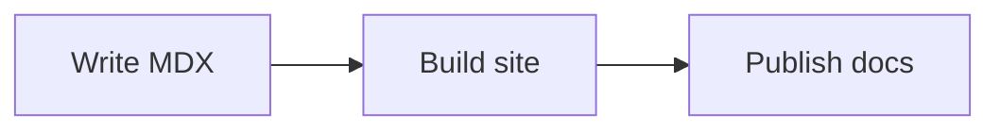

# Mermaid

`Mermaid` renders diagrams from text source. Use it for flows, sequences, state transitions, and relationships that should stay reviewable in version control.

## Usage

Use a `mermaid` code fence for the shortest authoring experience:

````md

````

Rendered result:


In generated MDX, call the component directly with `chart`:

```mdx
<Mermaid chart={'sequenceDiagram\n  Author->>Clarify: Save content\n  Clarify-->>Reader: Updated page'} />
```

## Props

| Prop | Type | Default | Description |
|------|------|---------|-------------|
| `chart` | `string` | Required | Mermaid diagram source |
| `className` | `string` | - | Class name for the diagram container |

<Callout type="tip">Prefer labels that still explain the flow when the raw source is shown during loading or when rendering fails.</Callout>
