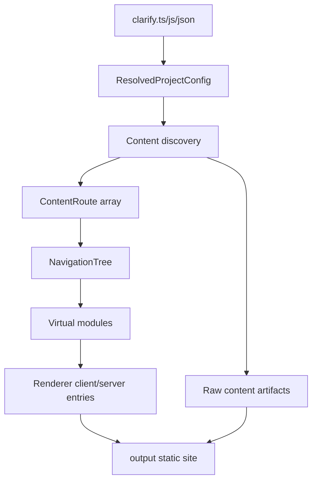

# 整体架构

Clarify 采用 Monorepo 结构组织，包含应用和包两个层级。

---

## Monorepo 结构

<FileTree aria-label="Clarify monorepo 结构">
  <FileTreeItem name="clarify" type="folder">
    <FileTreeItem name="apps" type="folder" description="端口 5173">
      <FileTreeItem name="docs" description="文档游乐场 & 开发站点" />
      <FileTreeItem name="www" description="营销网站 & 落地页" />
    </FileTreeItem>
    <FileTreeItem name="packages" type="folder">
      <FileTreeItem name="renderer" description="共享 React 组件 & UI 原语" />
      <FileTreeItem name="cli" description="Clarify CLI 与文档构建引擎" />
    </FileTreeItem>
  </FileTreeItem>
</FileTree>

---

## 工作空间职责

### `apps/docs` — 文档游乐场

- **用途**：作为主要开发环境和 Clarify 引擎的实时示例
- **关键特性**：
  - 消费 `@clarify-labs/renderer` 获取 UI 组件
  - 通过 `@clarify-labs/cli` 进行 MDX/OpenAPI 编译、路由、开发服务器和静态构建
  - 为 CLI 和渲染器变更提供真实的测试环境
- **依赖**：`@clarify-labs/renderer` (workspace), `@clarify-labs/cli` (workspace)
- **构建输出**：作为官方文档部署的静态站点

### `apps/www` — 营销站点

- **用途**：Clarify 项目的公共落地页和营销内容
- **关键特性**：
  - 独立的 React + Tailwind CSS 应用程序
  - 展示特性、快速入门指南和社区链接
- **依赖**：不依赖 `packages/*`（保持独立以简化部署）
- **构建输出**：部署到项目公共域的静态站点

### `packages/renderer` — 共享 React 组件

- **用途**：提供文档引擎使用的 React 运行时、应用壳和内容组件
- **关键组件**：
  - `AppShell`：文档站点的顶级应用壳，负责路由、导航、搜索、主题切换和内容操作
  - `Navigation` / `Header`：桌面端侧边栏、移动端导航和顶部栏
  - `Code` / `CodeGroup` / `Prose`：MDX 内容的基础排版与代码块组件
  - `OpenApiDocument` / `OpenApiOperation`：用于渲染 OpenAPI 页面和嵌入单个接口
- **分发**：使用 Vite library build 输出 ESM / CJS / DTS，以便 CLI 和用户项目消费
- **约束**：除 React / React Router 等 peer dependency 外，避免绑定具体应用；不要求用户维护渲染器入口

### `packages/cli` — Clarify CLI

- **用途**：将 MDX + OpenAPI 转换为可运行文档站点，并提供用户可直接使用的命令行入口
- **关键职责**：
  - **命令封装**：提供 `clarify dev`、`clarify build`、`clarify init`
  - **MDX 编译**：集成 `@mdx-js/rollup` 将 `.md` / `.mdx` 文件编译为 React 组件
  - **OpenAPI 摄取**：读取 `*.openapi.yaml/json`，使用 `@clarify-labs/renderer` 组件生成类型安全的 API 参考页面
  - **路由生成**：自动从文件系统生成路由清单（例如 `docs/getting-started.mdx` → `/getting-started`）
  - **开发服务器**：为内容和 API 规范变更提供热更新
  - **构建集成**：发出适合部署的静态预渲染站点
- **配置**：支持 `clarify.ts`、`clarify.js` 和 `clarify.json`；推荐 `clarify.ts` 用于类型安全配置和插件
- **分发**：发布为 `@clarify-labs/cli`，暴露 `clarify` bin

---

## 数据流



1. **作者**在 `source/` 中编写 MDX/Markdown 文档和 OpenAPI 规范。
2. **`@clarify-labs/cli`**加载配置、扫描内容目录、解析 MDX/OpenAPI，并生成 `ContentRoute[]`。
3. **CLI** 根据路由和 `tabs` 配置生成 `NavigationTree`，并通过虚拟模块把数据交给渲染器。
4. **`packages/renderer`**消费 `config`、`routes`、`navigation` 和 `openApis`，渲染客户端和服务端入口。
5. **SSG 管线**输出静态 HTML、JS/CSS 资源、raw Markdown/OpenAPI 制品和 `llms.txt`。

---

## 系统边界

| 边界 | 输入 | 输出 |
|------|------|------|
| 用户项目 → CLI | `clarify.ts/js/json`、`source/`、`public/`、CLI 参数 | 解析后的配置、路由模型、虚拟模块、构建产物 |
| CLI → Renderer | `config`、`routes`、`navigation`、`openApis` | React 应用壳和页面 |
| Build → Deploy | `output/` | 静态 HTML、资源、复制的 public 文件、raw content artifacts、`llms.txt` |

不要把文件系统扫描、配置加载放进 Renderer；也不要把组件视觉逻辑放进 CLI，除非它被表达为稳定的数据模型。

---

## 核心数据模型

| 类型 | 所属 | 用途 |
|------|------|------|
| `ResolvedProjectConfig` | CLI | 站点标题、描述、路径前缀、主题、导航、页脚、i18n 和 tabs 的默认值。 |
| `ResolvedBuildOptions` | CLI | 内容根目录、输出目录和 SSG 行为。 |
| `ContentRoute` | CLI → Renderer | 单个可渲染路由，包含身份字段、`meta`、`module`、`source`、可选 OpenAPI 状态、诊断信息和生成的 `artifacts`。 |
| `NavigationTree` | CLI → Renderer | 侧边栏和 tab 导航，可本地化。 |

---

## 路由与导航模型

Clarify 从 `rootDirectory`（默认 `source`）派生路由：

```txt
source/index.mdx              → /
source/getting-started.mdx    → /getting-started
source/guides/index.mdx       → /guides
source/api.openapi.json       → /api
```

多语言项目使用 locale 目录。默认语言不带语言前缀，非默认语言带语言前缀；当 `i18n.missing` 为 `fallback` 时，缺失翻译会复用默认语言内容并标记为 fallback route。

导航有两种来源：

1. 未配置 `tabs` 时，基于文件树生成侧边栏。
2. 配置 `tabs` 时，每个 tab 拥有自己的 `pages`，可使用 `FileTree` 或显式分组。

Renderer 不从文件系统推断导航，只消费 CLI 生成的 `NavigationTree`。

---

## 插件模型

Clarify 内置 OpenAPI、content artifacts、HTML shell 等能力都通过插件 hook 接入。当前实现的 hook 包括：

| Hook | 作用 |
|------|------|
| `routes:discover` | 在路由发现阶段添加或修改路由。 |
| `routes:discovered` | 路由发现后补充元数据，例如解析 OpenAPI。 |
| `routes:resolved` | 修改最终路由和导航。 |
| `modules:before` | 在 Vite 消费前添加或修改虚拟模块。 |
| `html:transform` | 转换 HTML shell 和注入标签。 |
| `dev:configureServer` | 添加开发服务器中间件。 |
| `build:done` | SSG 后写入额外制品。 |

这套模型应该继续承载搜索索引、分析脚本、AI 翻译等后续扩展，避免在构建流程中添加一次性的特殊分支。

---

## 依赖规则

| 方向 | 是否允许 | 说明 |
|------|----------|------|
| Apps → Packages | ✅ | 应用通过 `workspace:*` 依赖包 |
| Packages → Apps | ❌ | 包必须保持应用无关 |
| 跨包依赖 | ✅ | 在 `package.json` 中使用 `workspace:*`，在开发中使用 Vite `resolve.alias` |
| 外部依赖 | ✅ | 优先选择维护良好、轻量级的库。仅限 React 生态 |

---

## 技术栈

| 层级 | 技术 | 版本 | 理由 |
|------|------|------|------|
| 框架 | React | 19.x | 最新稳定版，并发特性，服务器组件就绪 |
| 样式 | Tailwind CSS | 4.x | 工具优先，最小 CSS 输出，设计系统友好 |
| CLI 内部构建工具 | Vite | 8.x | 快速 HMR，优化生产构建，作为实现细节封装在 CLI 内部 |
| 语言 | TypeScript | 5.x | 严格模式，出色的 DX，类型安全的 MDX/OpenAPI 摄取 |
| 包构建器 | Vite library build | 8.x | 当前包构建脚本使用 `vite build` 输出 ESM / CJS / DTS |
| 包管理器 | pnpm | 9.x | Workspace 原生，确定性，磁盘高效 |
| Monorepo | pnpm workspaces | - | 简单，快速，无需额外工具 |

---

## 构建顺序与开发工作流

### 开发（无需预构建）

文档站点通过 `@clarify-labs/cli` 启动，普通用户无需维护构建工具配置。你可以运行：

```bash
pnpm dev:docs   # 启动文档游乐场
pnpm dev:www    # 启动营销站点
```

### 生产构建

```bash
pnpm build      # 构建所有包和应用
```
