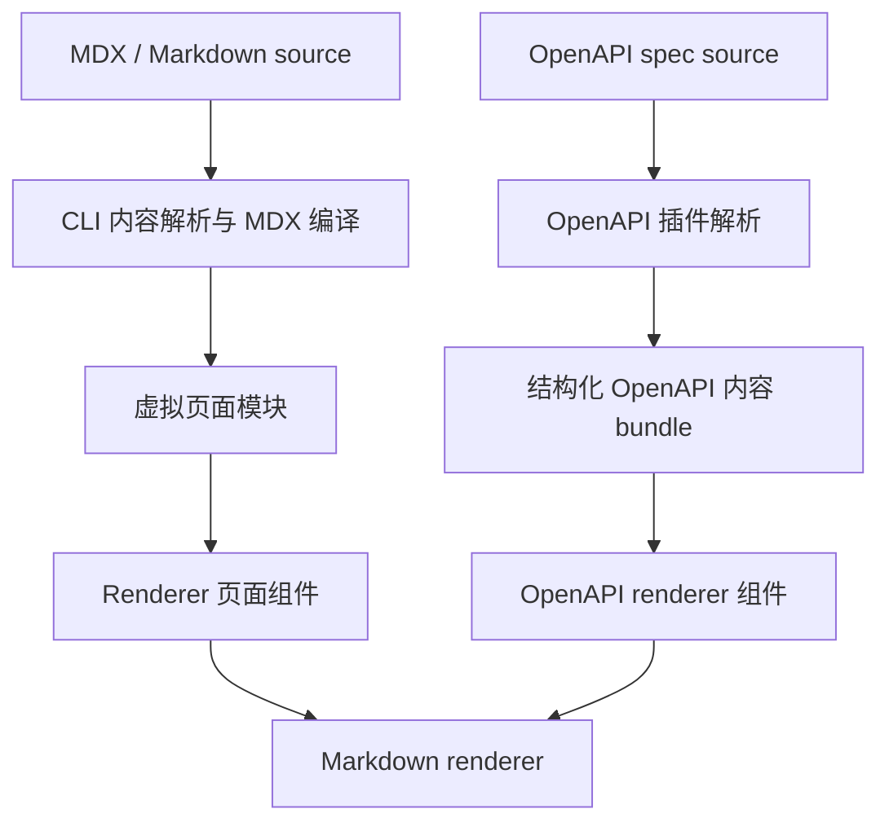
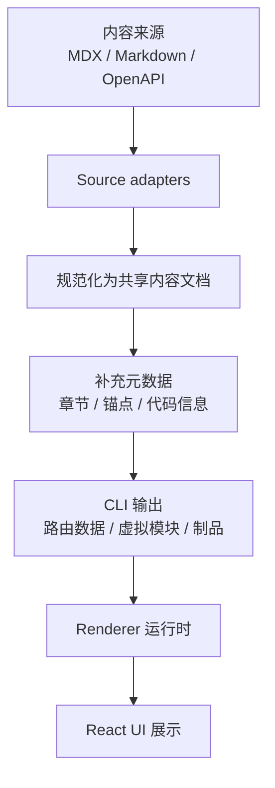

# 统一内容管线架构设计

状态：提案设计

Clarify 目前接收的内容来源有多种：MDX 文档、Markdown 片段、OpenAPI description，以及未来可能新增的其他内容类型。这个设计的目标，是让它们都走一条共享的内容管线：先把内容语义规范化一次，再由 Renderer 负责最终展示。

---

## 当前实现状态

目前仓库中已经把两条主要内容路径拆开处理：

- MDX 与 Markdown 页面内容由 CLI 侧负责发现和编译，主要经过 [packages/cli/source/parsers/routes.ts](packages/cli/source/parsers/routes.ts)、[packages/cli/source/parsers/mdx.ts](packages/cli/source/parsers/mdx.ts) 和 [packages/cli/source/core/plugin.ts](packages/cli/source/core/plugin.ts)。
- OpenAPI description 由 OpenAPI 插件解析，主要经过 [packages/cli/source/plugins/openapi/index.ts](packages/cli/source/plugins/openapi/index.ts) 和 [packages/cli/source/plugins/openapi/parser.ts](packages/cli/source/plugins/openapi/parser.ts)，再交给 Renderer 中的 [packages/renderer/source/openapi/entry.tsx](packages/renderer/source/openapi/entry.tsx) 和 [packages/renderer/source/openapi/components/EndpointSections.tsx](packages/renderer/source/openapi/components/EndpointSections.tsx) 渲染。

因此，当前系统实际存在两个内容规范化入口：



两条路径的共同点是：最终都会依赖 [packages/renderer/source/mdx/Markdown.tsx](packages/renderer/source/mdx/Markdown.tsx) 和 [packages/renderer/source/mdx/remark.ts](packages/renderer/source/mdx/remark.ts) 中的共享 Markdown 渲染能力。差异在于：MDX 内容更早在 CLI 管线中完成规范化，而 OpenAPI description 则先作为结构化 spec 的一部分准备，再在 Renderer 的 OpenAPI 组件路径中被消费。

---

## 为什么需要这份设计

现在系统里已经有两条不同的内容处理路径：

- MDX 页面会在 CLI 管线中编译。
- Markdown 片段，例如 OpenAPI 的 description，会在 Renderer 里按需渲染。

这套方式能工作，但同时带来两个问题：

1. Markdown 处理被拆散到了多个层级。
2. 后续增加新的内容类型时，很难用同一套规则做内容分析和展示。

这份架构设计希望解决的是：

- 把所有文本类内容先统一为一个共享内容模型。
- 内容语义在 CLI/内容管线中规范化一次。
- Renderer 只负责把这个内容模型变成最终 UI。

---

## 设计目标

这份设计需要达到的目标包括：

- 让所有文本内容都走同一套规范化流程
- 保持 CLI 负责内容准备与元数据生成
- 保持 Renderer 负责展示、样式和交互
- 保留 MDX 组件与富文档功能的支持
- 让 OpenAPI 的 description 具有和 MDX 内容一致的格式能力
- 为未来新增内容类型留出清晰扩展路径

## 非目标

这份设计不打算：

- 把所有 UI 行为都挪到 CLI
- 替换 React 与 Renderer 运行时
- 强迫所有内容类型在组件层面完全一致

---

## 核心设计原则

### 1. 先处理内容语义

如果一项能力是在表达内容含义、结构或元数据，那么它属于内容层。比如标题、列表、表格、代码块、链接，以及章节元信息。

### 2. 展示行为留给 Renderer

如果一项能力是在控制视觉效果或交互行为，那么它属于展示层。比如排版、主题样式、客户端交互、hydration 等。

### 3. 统一的中间表示

所有内容来源都应先转换为一个共享的中间表示，而不是直接生成最终 HTML。这个表示应该保留语义结构，但不绑定具体 UI 实现。

### 4. 逐步迁移，而不是一次性重写

应该先引入共享模型，再逐步把现有内容路径切到新架构上，避免一次性破坏现有行为。

---

## CLI 与 Renderer 的边界

CLI 和 Renderer 的边界应该切在“带类型的内容块契约”上。

CLI 侧重于内容准备和信息提取。它负责内容发现、路由解析、frontmatter 解析、OpenAPI spec 加载、数据解析、诊断、元数据提取和制品生成。CLI 可以解析源数据，用来理解 route、标题、章节、heading、OpenAPI operation、搜索和导航所需的信息；但它不做任何展示渲染。

Renderer 负责所有渲染行为。它决定 Markdown 如何变成 React UI，OpenAPI operation 如何展示，参数和响应里的 OpenAPI description Markdown 如何渲染，自定义 MDX 组件如何解析，以及主题、locale、hydration 和客户端交互如何接入。

因此，两层之间传递的数据应该尽量贴近源内容和提取出的事实：

| 类别 | 归属 | 形态 | 用途 |
|---|---|---|---|
| 内容块 | CLI | 带 `kind` 的 `Content[]`，例如 `markdown` 和 `openapi` | 描述页面上应该出现什么内容，但不描述如何渲染 |
| 提取出的元数据 | CLI | route、title、sections、locale、source reference、OpenAPI pointer | 支撑路由、导航、搜索、诊断和静态制品 |
| 展示实现 | Renderer | React components、Markdown renderer、OpenAPI renderer、hooks | 把内容块转成最终 UI、主题、布局和交互 |

关键规则是：CLI 可以解析数据，但不能渲染数据；Renderer 可以渲染富内容，但不应该重新发现源文件，也不应该重建 CLI 已经准备好的 route 级事实。

这条切割线能让两边职责更清楚：

- CLI 准备内容块，以及关于这些内容块的事实。
- Renderer 按 `kind` 分发每个内容块，并把它变成 UI。
- Bundler 在需要执行 MDX 或 React 组件时负责连接两边，但展示职责仍然属于 Renderer。

---

## 统一的中间表示

共享中间表示应该是一份由带类型内容块组成的文档。它不需要一套额外的合成 AST，也不应该提前把 Markdown 渲染成 HTML 或 JSX。模型只描述“有什么内容”，Renderer 再决定每个内容块“如何展示”。

```ts
type ContentDocument = {
  id: string
  title?: string
  source?: string
  content: Content[]
  metadata: ContentMetadata
}

type Content = MarkdownContent | OpenAPIContent

type MarkdownContent = {
  kind: 'markdown'
  value: string
  source?: ContentSource
}

type OpenAPIContent = {
  kind: 'openapi'
  spec: OpenAPISpecReference
  source?: ContentSource
  operation?: OpenAPIOperationReference
}

type ContentMetadata = {
  sections?: Array<{ id?: string; title: string; level: number }>
  language?: string
}
```

这样做的好处是：

- 文档主体简单，并且保持顺序
- 每个内容块都明确声明自己的内容类型
- Markdown 内容在进入 Renderer 前仍然是 Markdown
- OpenAPI 内容在进入 Renderer 前仍然是 OpenAPI 数据或引用
- 后续新增内容类型时，可以增加新的 `kind`，而不是把核心模型变成一个大而全的对象

也就是说，`ContentDocument.content` 就是 CLI 和 Renderer 之间的切割线。CLI 组装带类型的内容块，并提取有用的元数据；Renderer 拥有 Markdown renderer、OpenAPI renderer，以及所有 React 相关展示逻辑。

---

## 架构总览



### 各层职责

| 层级 | 职责 |
|---|---|
| Source adapters | 从 MDX、Markdown 或 OpenAPI 来源中加载内容，并接入带类型的内容块 |
| Data parsing | 提取 route、section、OpenAPI operation、source reference、搜索和诊断信息 |
| Enrichment | 补上章节、锚点、代码块元信息和诊断信息 |
| Renderer | 把规范化内容变成最终 UI |

---

## 各类内容如何接入

### MDX 页面

MDX 页面仍然保留在 CLI 中编译，但编译后的内容应先被表示为共享内容文档，再交给 Renderer。这样可以让页面级内容与其他内容类型共享同一种处理契约。

### Markdown 片段

像 OpenAPI 的 description 这类嵌入式内容，应该走和 MDX 内容相同的规范化路径。区别只在“来源适配器”，不在“渲染契约”。

### OpenAPI 的 description

OpenAPI 的 description 本身是规范数据，其中承载的 Markdown 是内容表达。它应该在 OpenAPI 数据模型或提取出的内容块中继续保持为 Markdown 字符串。Renderer 在展示这些 description 的地方，通过共享 Markdown renderer 统一渲染。

### OpenAPI 内容块的准备方式

对于 OpenAPI 来说，最直接的落地方式是 CLI 准备 spec 引用和提取出的元数据，Markdown 渲染则交给 Renderer。

具体步骤可以是：

1. 在 CLI 的 OpenAPI 解析阶段，加载并校验 spec，解析 route 级 operation 目标，并提取 tags、operation id、sections、source pointer 等元数据。
2. 保持原始 OpenAPI spec 不变，包括 `info.description`、`paths.*.*.description`、`parameters.description`、`requestBody.description`、`responses.*.description`、`schema.description` 等字段里的 Markdown 字符串。
3. 输出一个 `openapi` 内容块，指向 spec，并在需要时指向具体 operation。
4. 让 Renderer 渲染这个 OpenAPI 内容块，并在每个 description 展示点调用共享 Markdown renderer。

一个最小的形状可以是：

```ts
type OpenAPIContentBlock = {
  kind: 'openapi'
  spec: OpenAPISpecReference
  source?: ContentSource
  operation?: OpenAPIOperationReference
}
```

这样做的好处是：

- OpenAPI 的 description 可以和 MDX 内容共享同一个 Renderer-owned Markdown 渲染路径
- 所有 OpenAPI description 字段都会在展示位置通过同一个 Markdown 组件渲染
- 后续如果要支持 Callout、CodeGroup、Mermaid 等能力，也只需要在 Renderer 拥有的 Markdown 路径里处理

从实现位置看，最合适的切入点是 [packages/cli/source/plugins/openapi/parser.ts](packages/cli/source/plugins/openapi/parser.ts) 和 [packages/cli/source/plugins/openapi/index.ts](packages/cli/source/plugins/openapi/index.ts)，然后再由 [packages/renderer/source/openapi/entry.tsx](packages/renderer/source/openapi/entry.tsx) 读取并渲染。

### 未来新内容类型

任何未来新增内容类型都可以复用同样的路径：

1. 加一个 source adapter
2. 规范化为共享内容文档
3. 由 Renderer 统一消费

---

## 方案评估

这个方案的大方向是成立的，因为它确实回应了当前架构里的真实割裂：MDX 内容和 OpenAPI Markdown description 现在从不同入口进入系统，但最终又依赖同一套 Markdown 渲染能力。

主要取舍在于：这个模型让 CLI 更简单，也更不绑定 Renderer，但会把更多渲染责任集中到 Renderer。这个边界对 Clarify 更合理：CLI 可以解析数据和提取事实，Renderer 则拥有所有 Markdown 与 OpenAPI 展示行为。

### 优点

- 它能把 MDX 页面和 OpenAPI description 的 Markdown 行为统一到同一条概念管线中，减少重复实现和行为漂移。
- 它基本保留了现有 CLI / Renderer 边界：CLI 继续准备内容和元数据，Renderer 继续掌控 UI、主题、hydration 和交互。
- 它能显著增强 OpenAPI description。当前 description 只是 OpenAPI 组件里的 Markdown 字符串；新路径可以让它复用 MDX 内容已有的富格式能力。
- 它对未来扩展更友好。新增内容来源时，只需要增加 source adapter，而不是再造一条解析和渲染路径。
- 它给内容感知能力提供了更清晰的位置。章节提取、代码块元信息、搜索制品和诊断信息都可以围绕同一套规范化内容模型生成。
- 它天然支持在 MDX 页面中嵌入 OpenAPI 内容，因为 Markdown 和 OpenAPI 都只是有序内容块。
- 它避免 CLI 绑定 React、JSX 或 Renderer 专属 Markdown 行为。

### 缺点

- 如果页面包含大量 Markdown 片段，运行时 Markdown 渲染可能比构建期预处理更有成本；如果后续压测证明有影响，Renderer 侧可能需要缓存。
- 搜索、目录和章节提取仍然需要 CLI 侧解析。这个解析是允许的，但它必须保持为信息提取，而不是展示渲染。
- 一些 Markdown 渲染错误可能从构建期移动到 Renderer 阶段，除非 CLI 额外运行非渲染性质的校验。
- 这个方案可能高估了 MDX 与 OpenAPI 的可共享程度。MDX 是作者主动书写的组件化内容，OpenAPI description 是 schema 数据里的说明字段。它们应该共享 Markdown 语义，但不一定应该共享完整的文档契约。
- 安全边界和组件范围需要明确。OpenAPI description 可以支持 Markdown、Mermaid 和代码格式，但是否允许任意 MDX 组件执行，需要作为明确的产品决策，而不是被统一管线顺带引入。

### 架构隐患

最大的隐患是以“规范化”的名义，把渲染责任又放回 CLI。CLI 可以解析 Markdown 和 OpenAPI 数据，用来提取 heading、section、operation id、搜索文本、诊断信息和 source reference；但它不应该把这些输入转换成 UI 专属的 React tree、HTML 或 Renderer 组件结构。

更稳妥的表达方式，是保持 block-based 文档模型：

```ts
type ContentDocument = {
  content: Content[]
  metadata: ContentMetadata
}

type Content = MarkdownContent | OpenAPIContent
```

在这个模型里，`markdown` block 保留 Markdown 源文本，`openapi` block 保留 OpenAPI 数据或引用。Renderer 再负责把每种 block kind 映射成 React UI。

### 建议调整

更推荐的版本是：

1. 引入 `ContentDocument.content: Content[]` 作为共享契约。
2. Markdown 渲染留在 Renderer，包括当前 CLI 路径中偏渲染性质的 Markdown 处理。
3. CLI 只为了信息提取而解析内容：route 数据、heading、section、搜索文本、OpenAPI 元数据、诊断信息和 source reference。
4. OpenAPI description 在 Renderer 的每个展示点通过共享 Markdown renderer 渲染。
5. 把 MDX 页面和嵌入的 OpenAPI block 都视为有序内容块，这样独立 API 页面和 MDX 内嵌接口可以复用同一个 OpenAPI renderer。

经过这层调整后，方案仍然保留最重要的收益：统一 Markdown 与 OpenAPI 渲染语义；同时让 CLI 专注于准备和提取，而不是展示。

---

## 实施计划

### 第 1 阶段：引入共享模型

- 定义共享内容文档类型
- 定义第一批 `Content` kind：`markdown` 和 `openapi`
- 保留现有 Renderer API，先通过兼容层接入

### 第 2 阶段：让 OpenAPI description 走共享模型

- 保留现有 OpenAPI 数据结构不变
- 让 OpenAPI description 字段通过 Renderer 拥有的共享 Markdown 组件渲染
- 确保 `info.description`、operation description、parameter description、request body description、response description、schema/property description 都走同一条路径

### 第 3 阶段：统一 MDX 页面内容处理

- 让 MDX 页面发现阶段产出带有有序内容块的共享文档
- 把嵌入的 OpenAPI operation 表示为 `openapi` block，或者表示为消费同一个 OpenAPI renderer 的 Renderer 组件
- MDX 编译保留为 bundler/runtime 关注点，不变成 CLI 拥有的展示渲染

### 第 4 阶段：拓展到更多内容类型

- 继续补充 source adapter
- 保持 Renderer 入口稳定

---

## Renderer 的统一契约

Renderer 应该只消费一个稳定的契约：

```ts
function renderContentDocument(document: ContentDocument, context: RenderContext): ReactNode
```

Renderer 会决定：

- 每种 `Content.kind` 如何映射成最终 UI
- Markdown 字符串如何解析和渲染
- OpenAPI block 如何渲染
- 组件节点（如 Callout、CodeGroup、Mermaid）如何渲染
- 主题、locale 和客户端交互如何接入

这样 Renderer 依然有足够灵活性，同时避免 CLI 拥有展示渲染。

---

## 迁移策略

建议采用渐进迁移，而不是大改：

1. 保留当前 Markdown 组件，先作为兼容封装。
2. 引入共享内容文档和 `Content[]` block 类型。
3. 先让 OpenAPI 页面从 `openapi` block 渲染。
4. 再把 MDX 页面内容迁移到同一套有序 block 契约。
5. Renderer-owned 路径验证完成后，再清理重复渲染逻辑。

---

## 风险与取舍

### 风险 1：过早抽象

如果共享模型过度抽象，就会变得难维护。它应该贴近源内容块，而不是变成一套完整 UI 抽象或合成 Markdown AST。

### 风险 2：组件支持变得模糊

MDX 页面中存在自定义组件。解决方法是把 MDX 执行和组件解析留在 Renderer/bundler 路径中，同时把 OpenAPI operation 这类结构化嵌入内容表达为明确的内容块。

### 风险 3：构建期和运行时职责边界变得模糊

CLI 应该负责准备内容、解析数据和生成元数据；Renderer 应该负责最终展示。如果某项能力会创建 UI、依赖浏览器上下文，或者把 Markdown/OpenAPI 数据映射成 React 组件，就应该留在 Renderer。

---

## 结论

最合适的长期架构，不是让 CLI 负责最终 HTML、JSX 或 Markdown UI 渲染，而是：

- CLI/内容管线负责准备带类型的内容块，并提取路由、搜索和导航事实
- Renderer 负责把这些内容块渲染成最终 UI

这条路线最适合 Clarify 的长期演进，也最容易把 MDX、Markdown 片段、OpenAPI description 和未来新内容类型纳入同一套机制。
