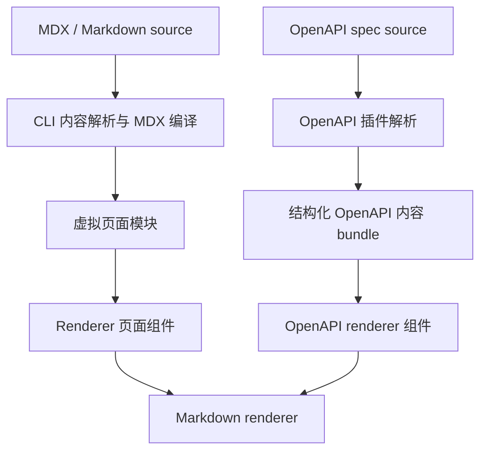
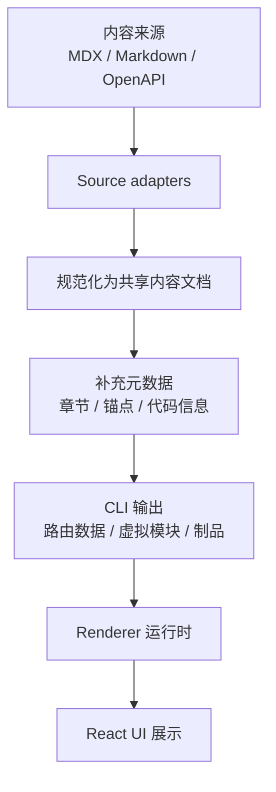

# 统一内容管线架构设计

状态：提案设计

Clarify 目前接收的内容来源有多种：MDX 文档、Markdown 片段、OpenAPI description，以及未来可能新增的其他内容类型。这个设计的目标，是让它们都走一条共享的内容管线：先把内容语义规范化一次，再由 Renderer 负责最终展示。

---

## 当前实现状态

目前仓库中已经把两条主要内容路径拆开处理：

- MDX 与 Markdown 页面内容由 CLI 侧负责发现和编译，主要经过 [packages/cli/source/parsers/routes.ts](packages/cli/source/parsers/routes.ts)、[packages/cli/source/parsers/mdx.ts](packages/cli/source/parsers/mdx.ts) 和 [packages/cli/source/core/plugin.ts](packages/cli/source/core/plugin.ts)。
- OpenAPI description 由 OpenAPI 插件解析，主要经过 [packages/cli/source/plugins/openapi/index.ts](packages/cli/source/plugins/openapi/index.ts) 和 [packages/cli/source/plugins/openapi/parser.ts](packages/cli/source/plugins/openapi/parser.ts)，再交给 Renderer 中的 [packages/renderer/source/openapi/entry.tsx](packages/renderer/source/openapi/entry.tsx) 和 [packages/renderer/source/openapi/components/EndpointSections.tsx](packages/renderer/source/openapi/components/EndpointSections.tsx) 渲染。

因此，当前系统实际存在两个内容规范化入口：



两条路径的共同点是：最终都会依赖 [packages/renderer/source/mdx/Markdown.tsx](packages/renderer/source/mdx/Markdown.tsx) 和 [packages/renderer/source/mdx/remark.ts](packages/renderer/source/mdx/remark.ts) 中的共享 Markdown 渲染能力。差异在于：MDX 内容更早在 CLI 管线中完成规范化，而 OpenAPI description 则先作为结构化 spec 的一部分准备，再在 Renderer 的 OpenAPI 组件路径中被消费。

---

## 为什么需要这份设计

现在系统里已经有两条不同的内容处理路径：

- MDX 页面会在 CLI 管线中编译。
- Markdown 片段，例如 OpenAPI 的 description，会在 Renderer 里按需渲染。

这套方式能工作，但同时带来两个问题：

1. Markdown 处理被拆散到了多个层级。
2. 后续增加新的内容类型时，很难用同一套规则做内容分析和展示。

这份架构设计希望解决的是：

- 把所有文本类内容先统一为一个共享内容模型。
- 内容语义在 CLI/内容管线中规范化一次。
- Renderer 只负责把这个内容模型变成最终 UI。

---

## 设计目标

这份设计需要达到的目标包括：

- 让所有文本内容都走同一套规范化流程
- 保持 CLI 负责内容准备与元数据生成
- 保持 Renderer 负责展示、样式和交互
- 保留 MDX 组件与富文档功能的支持
- 让 OpenAPI 的 description 具有和 MDX 内容一致的格式能力
- 为未来新增内容类型留出清晰扩展路径

## 非目标

这份设计不打算：

- 把所有 UI 行为都挪到 CLI
- 替换 React 与 Renderer 运行时
- 强迫所有内容类型在组件层面完全一致

---

## 核心设计原则

### 1. 先处理内容语义

如果一项能力是在表达内容含义、结构或元数据，那么它属于内容层。比如标题、列表、表格、代码块、链接，以及章节元信息。

### 2. 展示行为留给 Renderer

如果一项能力是在控制视觉效果或交互行为，那么它属于展示层。比如排版、主题样式、客户端交互、hydration 等。

### 3. 统一的中间表示

所有内容来源都应先转换为一个共享的中间表示，而不是直接生成最终 HTML。这个表示应该保留语义结构，但不绑定具体 UI 实现。

### 4. 逐步迁移，而不是一次性重写

应该先引入共享模型，再逐步把现有内容路径切到新架构上，避免一次性破坏现有行为。

---

## 统一的中间表示

更直接的思路是：内容文档的 body 本身就直接表达为一个 JSX 片段。也就是说，内容不是先被拆成一堆固定节点，再由 Renderer 去重新拼装，而是把内容的“最终可渲染形态”先收敛成一个可组合的 JSX 表达。

```ts
type ContentDocument = {
  title?: string
  source?: string
  content: JSX.Element
  metadata: {
    sections?: Array<{ id?: string; title: string; level: number }>
    language?: string
  }
}
```

这样做的好处是：

- 结构更直接，阅读和使用都更自然
- title、source、content、metadata 分层清晰
- 内容主体和附加信息被明确区分
- 后续扩展时只需要在 metadata 里继续增加字段，而不需要把所有信息都塞进一个大对象

也就是说，body 不是“数据结构的集合”，而是“一个可渲染的 JSX 片段”。内容来源是 MDX、Markdown 还是 OpenAPI，它们的差异主要体现在 content 和 metadata 上，而不是体现在 ContentDocument 的顶层类型上。

---

## 架构总览



### 各层职责

| 层级 | 职责 |
|---|---|
| Source adapters | 从 MDX、Markdown 或 OpenAPI 中解析内容并接入统一模型 |
| Normalization | 把来源特有语法转换成共享的 JSX 内容片段 |
| Enrichment | 补上章节、锚点、代码块元信息和诊断信息 |
| Renderer | 把规范化内容变成最终 UI |

---

## 各类内容如何接入

### MDX 页面

MDX 页面仍然保留在 CLI 中编译，但编译后的内容应先被表示为共享内容文档，再交给 Renderer。这样可以让页面级内容与其他内容类型共享同一种处理契约。

### Markdown 片段

像 OpenAPI 的 description 这类嵌入式内容，应该走和 MDX 内容相同的规范化路径。区别只在“来源适配器”，不在“渲染契约”。

### OpenAPI 的 description

OpenAPI 的 description 本身是规范数据，其中承载的 Markdown 是内容表达。它不应该被当成纯 UI 组件，也不应该绕过统一内容处理流程。正确的方式是：先把它规范化成共享内容文档，再由 Renderer 渲染。

### OpenAPI 预处理为 JSX 的实现路径

对于 OpenAPI 来说，最直接的落地方式不是在 Renderer 里再去用一套 Markdown 解析器，而是在 CLI 的解析阶段把 description 预处理成 JSX 内容。

具体步骤可以是：

1. 在 CLI 的 OpenAPI 解析阶段，遍历 spec 中所有“内容型字段”，例如 `info.description`、`paths.*.*.description`、`parameters.description`、`requestBody.description`、`responses.*.description`、`schema.description` 等。
2. 对每个字符串内容，先走统一的 Markdown 规范化流程，得到可组合的 JSX 片段，而不是直接生成最终 HTML。
3. 把这些预处理结果挂到一个与 spec 并行的内容 bundle 上，保持原始 OpenAPI 数据不变，避免影响现有 JSON 产物和内容归档逻辑。
4. 让 Renderer 直接消费这个 bundle 中的 `content`，也就是已经是 JSX 的内容，而不是再去做一次运行时 Markdown 解析。

一个最小的形状可以是：

```ts
type OpenAPIContentBlock = {
  content: JSX.Element
  metadata: {
    source: 'openapi-description'
    language?: string
  }
}
```

这样做的好处是：

- OpenAPI 的 description 可以和 MDX 内容共享同一个“内容已预处理好”的模型
- 运行时不再重复解析 Markdown
- Renderer 只需要负责最终渲染，不需要自己处理描述文本的语法
- 后续如果要支持 Callout、CodeGroup、Mermaid 等组件，也能直接挂到 `content` 里

从实现位置看，最合适的切入点是 [packages/cli/source/plugins/openapi/parser.ts](packages/cli/source/plugins/openapi/parser.ts) 和 [packages/cli/source/plugins/openapi/index.ts](packages/cli/source/plugins/openapi/index.ts)，然后再由 [packages/renderer/source/openapi/entry.tsx](packages/renderer/source/openapi/entry.tsx) 读取并渲染。

### 未来新内容类型

任何未来新增内容类型都可以复用同样的路径：

1. 加一个 source adapter
2. 规范化为共享内容文档
3. 由 Renderer 统一消费

---

## 实施计划

### 第 1 阶段：引入共享模型

- 定义共享内容文档类型
- 创建统一的 Markdown 规范化模块
- 保留现有 Renderer API，先通过兼容层接入

### 第 2 阶段：让 OpenAPI description 走共享模型

- 把 OpenAPI description 先接入统一 Markdown 规范化路径
- 保留现有 OpenAPI 数据结构不变
- 让它走统一的渲染入口

### 第 3 阶段：统一 MDX 页面内容处理

- 让 MDX 页面编译后也产出共享内容文档
- Renderer 从多条老路径逐步迁移到统一内容模型

### 第 4 阶段：拓展到更多内容类型

- 继续补充 source adapter
- 保持 Renderer 入口稳定

---

## Renderer 的统一契约

Renderer 应该只消费一个稳定的契约：

```ts
function renderContentDocument(document: ContentDocument, context: RenderContext): ReactNode
```

Renderer 会决定：

- `content` 如何映射成最终的段落、列表、代码块和组件结构
- 组件节点（如 Callout、CodeGroup、Mermaid）如何渲染
- 主题、locale 和客户端交互如何接入

这样 Renderer 依然有足够灵活性，但不再负责解析内容源。

---

## 迁移策略

建议采用渐进迁移，而不是大改：

1. 保留当前 Markdown 组件，先作为兼容封装。
2. 引入共享内容文档类型和规范化模块。
3. 先把 OpenAPI description 切到新路径。
4. 再把 MDX 内容路径迁移到统一契约。
5. 直到旧逻辑完全被新链路覆盖后，再清理冗余解析代码。

---

## 风险与取舍

### 风险 1：过早抽象

如果共享模型过度抽象，就会变得难维护。它应该贴近 Markdown/MDX 的语义结构，而不是变成一套完全通用 UI 抽象。

### 风险 2：组件支持变得模糊

MDX 页面中存在自定义组件。解决方法是把组件节点保存在内容树中，让 Renderer 显式解析和渲染。

### 风险 3：构建期和运行时职责边界变得模糊

CLI 应该负责准备内容和生成元数据；Renderer 应该负责最终展示。如果某项能力依赖浏览器上下文，就应该留在 Renderer。

---

## 结论

最合适的长期架构，不是让 CLI 负责最终 HTML 渲染，也不是让 Renderer 自己重新解析所有内容源，而是：

- CLI/内容管线负责把内容规范化成共享内容文档
- Renderer 负责把这个内容文档变成最终 UI

这条路线最适合 Clarify 的长期演进，也最容易把 MDX、Markdown 片段、OpenAPI description 和未来新内容类型纳入同一套机制。
