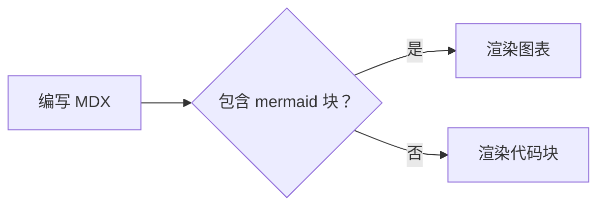

# 写作文档

这是一份可以直接交给文档作者或 AI 的写作规范。按本文完成一篇文档后，它应当同时满足四个条件：读者能完成一个明确任务，页面能被 Clarify 正确构建，站内搜索能定位关键章节，AI 能从原始 Markdown 和 `llms.txt` 理解并引用内容。

<Callout type="tip" title="最短路径">
  不确定怎么开始时：先按用户任务命名文件，默认使用 `.md`，写一个明确的 H1 和一句目标说明，再用 H2 拆出前置条件、操作步骤、验证结果和故障排查。只有需要 Clarify 组件时才改成 `.mdx`。
</Callout>

---

## 从需求到一篇正确的文档

<Steps>
  <Step title="定义读者和结果">
    用一句话写清“谁要完成什么”。例如：“后端开发者在本地创建 API 密钥，并验证第一个请求成功。”如果一句话里有两个互不依赖的结果，拆成两篇文档。
  </Step>
  <Step title="选择内容类型和文件位置">
    教程与概念说明使用 `.md`；需要 Tabs、Steps、Callout、OpenAPI 嵌入或自定义 React 组件时使用 `.mdx`；接口事实放入 `.openapi.json` 或 `.openapi.yaml`。文件路径就是页面路由。
  </Step>
  <Step title="先写可完成的主流程">
    按“前置条件 → 操作 → 预期结果”组织内容。命令和配置示例应包含完成当前步骤所需的上下文，不要只给无法运行的片段。
  </Step>
  <Step title="选择 Clarify 的表达能力">
    顺序操作用 `Steps`，互斥方案用 `Tabs`，关键风险用 `Callout`，多语言代码用 `CodeGroup`，接口事实用 OpenAPI。组件服务于理解，不用于装饰页面。
  </Step>
  <Step title="预览、检查和构建">
    在开发服务器中检查路由、目录、链接和窄屏布局，然后运行 `clarify check` 与 `clarify build`。构建成功才表示 MDX、链接到的内容和 OpenAPI 规范达到了发布要求。
  </Step>
</Steps>

### 可直接使用的页面模板

下面的模板刻意保持为普通 Markdown。删除不需要的章节；需要组件时，将文件扩展名改为 `.mdx`。

````md title="source/guides/create-api-key.md"
---
title: 创建 API 密钥
description: 创建一个 API 密钥，并验证它可以访问 Acme API。
keywords:
  - API 密钥
  - 认证
---

# 创建 API 密钥

本指南帮助后端开发者创建 API 密钥，并通过一次测试请求确认密钥可用。

## 前置条件

- 已有 Acme 项目管理员权限。
- 已安装 curl 8 或更高版本。

## 创建密钥

1. 打开控制台的 **API 密钥** 页面。
2. 选择 **创建密钥**，输入用途名称，然后保存。
3. 立即将密钥写入环境变量；密钥只显示一次。

```bash
export ACME_API_KEY="your-api-key"
```

## 验证结果

```bash
curl https://api.example.com/v1/me \
  --header "Authorization: Bearer $ACME_API_KEY"
```

请求成功时返回当前账号，并且 HTTP 状态码为 `200`。

## 故障排查

### 返回 401

确认环境变量没有多余空格，并且密钥尚未被撤销。

## 下一步

继续阅读 [API 文档](/features/openapi)。
````

这个模板包含可检索标题、完整输入、明确结果和下一步。不要把“点击按钮”“运行下面的命令”当成完整说明：请同时写出按钮名称、命令作用、成功信号和失败后的处理方式。

---

## 按内容需求选择 Clarify 能力

| 你正在写什么 | 使用什么 | 为什么 |
|------|------|------|
| 安装、迁移或配置流程 | `Steps` / `Step` | 明确顺序和每一步的完成边界 |
| 语言、框架、平台等互斥方案 | `Tabs` / `Tab` | 让读者只查看与自己相关的方案 |
| 风险、前提、成功结果 | `Callout` 或 `Note` | 区分必须注意的信息与补充背景 |
| 多种等价代码实现 | `CodeGroup` | 在一个位置比较并复制代码 |
| 项目目录 | `FileTree` / `FileTreeItem` | 准确表达文件层级和放置位置 |
| 配置字段或组件属性 | `Properties` / `Property` | 统一展示名称、类型和说明 |
| 架构、状态或调用顺序 | Mermaid 代码块 | 图表可版本管理、搜索并自动适配主题 |
| 功能入口和推荐阅读 | `CardGroup` / `Card` | 建立清晰的跨页面阅读路径 |
| 单个接口嵌入教程 | `OpenApiOperation` | 让规范维护接口事实，教程解释业务流程 |
| 完整 API Reference | `.openapi.json/.yaml` 或 `OpenApiDocument` | 自动提供认证、参数、示例和请求代码 |
| 重复的产品名、版本和 URL | [项目变量](/features/variables) | 一处维护，并同步到 MDX、Frontmatter 和 OpenAPI |
| 可被搜索和 AI 读取的发布内容 | 清晰的 H2/H3、原始内容和 `llms.txt` | Clarify 会在构建时生成全文索引与 AI 发现入口 |

完整属性和示例见 [内置组件](/reference/built-in-components)，接口文档工作流见 [API 文档](/features/openapi)。

---

## 推荐目录结构

把文档按读者任务组织，而不是按内部模块组织：

<FileTree aria-label="推荐的文档目录结构">
  <FileTreeItem name="source" type="folder">
    <FileTreeItem name="index.md" />
    <FileTreeItem name="getting-started.md" />
    <FileTreeItem name="guides" type="folder">
      <FileTreeItem name="writing.md" />
      <FileTreeItem name="deploy.mdx" />
    </FileTreeItem>
    <FileTreeItem name="reference" type="folder">
      <FileTreeItem name="config.mdx" />
    </FileTreeItem>
    <FileTreeItem name="api.openapi.json" />
  </FileTreeItem>
</FileTree>

启用国际化时，把同样的结构放进 locale 目录：

<FileTree aria-label="多语言文档目录结构">
  <FileTreeItem name="source" type="folder">
    <FileTreeItem name="zh-CN" type="folder">
      <FileTreeItem name="index.md" />
      <FileTreeItem name="getting-started.mdx" />
    </FileTreeItem>
    <FileTreeItem name="en-US" type="folder">
      <FileTreeItem name="index.md" />
      <FileTreeItem name="getting-started.mdx" />
    </FileTreeItem>
  </FileTreeItem>
</FileTree>

---

## 文件就是路由

Clarify 按照 `source/` 下的文件结构生成页面路径：

| 文件 | 路由 |
|------|------|
| `source/index.md` | `/` |
| `source/getting-started.md` | `/getting-started` |
| `source/guides/index.md` | `/guides` |
| `source/guides/auth.mdx` | `/guides/auth` |
| `source/api.openapi.json` | `/api` |

规则：

- `index.md` 或 `index.mdx` 映射为所在目录根路径。
- 文件名建议使用小写和连字符，例如 `api-authentication.mdx`。
- 支持 `.md`、`.mdx` 内容文件，以及 `.openapi.json`、`.openapi.yaml`、`.openapi.yml` 规范文件。
- 如果站点部署在子路径，使用 `routePrefix` 配置前缀，见 [配置站点](/guides/navigation)。

---

## 选择 Markdown 或 MDX

Clarify 对 `.md` 和 `.mdx` 使用不同的解析语义。两者都支持 Frontmatter、<Tooltip content="GitHub Flavored Markdown">GFM</Tooltip>、代码高亮、Mermaid、标题目录和搜索；区别在于页面是否需要 JSX 能力。

| 能力 | `.md` | `.mdx` |
|------|-------|--------|
| 标准 Markdown 和 GFM | 支持 | 支持 |
| 原始 HTML | 支持 | 按 JSX 语法解析 |
| 内置或自定义 React 组件 | 不支持 | 支持 |
| `import` / `export` | 不支持 | 支持 |
| JavaScript 表达式 `{...}` | 不支持 | 支持 |

**默认选择 `.md`**。它适合教程、指南和参考内容，也兼容普通 HTML 的写法：

```md

```

**只有在页面需要组件或表达式时才选择 `.mdx`**。MDX 中的标签遵循 JSX 规则，因此没有子节点的标签必须自闭合：

```mdx


<Callout type="tip">
  这段内容由 React 组件渲染。
</Callout>


```

把普通内容保留为 `.md` 可以避免 HTML 被误判为 JSX，也能更早发现真正的 MDX 组件语法错误。更改扩展名不会改变文件路由，例如 `source/guide.md` 和 `source/guide.mdx` 都映射到 `/guide`；同一路径不要同时存在两个文件。

---

## MDX 基础

MDX 文件可以写普通 Markdown，也可以嵌入 JSX。

```mdx
# 标题

**粗体**、*斜体*、`行内代码`。

- 列表项 1
- 列表项 2

> 引用块
```

嵌入 JSX：

```mdx
# 欢迎使用

<div className="rounded-lg border p-4">
  这是一个 React 片段。
</div>
```

导入自定义组件：

```mdx
import { Alert } from '../components/Alert'

# 页面标题

<Alert type="warning">
  这是一条警告信息。
</Alert>
```

---

## Frontmatter

每个页面顶部可以添加 YAML frontmatter，用于页面标题和描述：

```mdx
---
title: 页面标题
description: 页面描述，用于 SEO 和社交分享
---

# 正文内容
```

当前稳定字段：

| 字段 | 类型 | 说明 |
|------|------|------|
| `title` | `string` | 页面标题；为空时会尝试使用第一个 `h1` |
| `description` | `string` | 页面描述，用于 SEO meta |
| `keywords` / `keyword` / `tags` | `string \| string[]` | 页面关键词，会写入 HTML `keywords` meta |

> 当前版本不提供 `navOrder`、`hidden` 等高级 frontmatter 字段。要控制侧边栏，请在 `clarify.ts` 中显式配置 `tabs`。

---

## 标题、目录与搜索

Clarify 会从内容中提取 H2/H3 作为页面章节。章节会用于页面内导航和站内搜索，因此标题不是纯排版元素，也是信息架构的一部分。

```mdx
# API 文档

## 认证

### 创建访问令牌

## 分页
```

建议：

- H1 表达页面主题；如果 frontmatter 没有 `title`，Clarify 会尝试用 H1 作为页面标题。
- H2 表达用户任务或主要问题，例如“创建访问令牌”“部署到 GitHub Pages”。
- H3 表达任务中的子步骤或细分场景。
- 避免大量使用“介绍”“更多”“其他”这类弱标题。

内置搜索现在由 Pagefind 驱动：生产构建会输出可直接静态部署的 `/pagefind/` 索引，开发服务器也会生成临时索引并正常加载。搜索结果会优先匹配全文内容并展示高亮摘要；当索引尚未可用时，会回退到页面标题、导航节点、路径和 H2/H3 章节标题的快速跳转。

多语言站点会根据当前语言加载对应索引。Clarify 的公开 locale 使用 BCP 47，例如 `zh-CN`、`en-US`，搜索索引会在内部适配 Pagefind 的语言键处理。

---

## 代码块与 GFM

代码块会自动高亮。建议始终标注语言名，这样可以获得更准确的语法高亮和复制体验：

```typescript
function greet(name: string): string {
  return `Hello, ${name}!`
}
```

如果语言名无法识别，Clarify 会回退为普通代码块渲染，不会阻塞页面构建。

内置 GitHub Flavored Markdown 支持：

| 语法 | 是否支持 |
|------|----------|
| 表格 | 支持 |
| 任务列表 | 支持 |
| 删除线 | 支持 |
| 自动链接 | 支持 |

```mdx
- [x] 支持表格
- [x] 支持任务列表
- [ ] 支持更多写作体验
```

---

## Mermaid 图表

在围栏代码块上标注 `mermaid` 语言即可渲染图表。图表在客户端渲染，并会自动跟随亮色/暗色主题：

````mdx

````

上面的示例会渲染为：


支持所有 Mermaid 图表类型（流程图、时序图、类图、状态图、ER 图、甘特图等）。如果图表解析失败，Clarify 会在原始源码旁展示错误信息，而不会让页面构建中断。

大图也能看清：每个渲染后的图表都支持缩放和平移。滚轮缩放、拖拽平移、双击重置，也可以使用悬停时出现的缩放控件。

---

## 内置组件

Clarify 在 MDX 中默认注册了一组公开组件，无需手动导入即可直接使用：

- `Steps` / `Step`
- `Tabs` / `Tab`
- `Callout`、`Note`
- `CardGroup` / `Card`
- `Button`
- `CodeGroup`
- `Collapse`、`AccordionGroup`
- `FileTree` / `FileTreeItem`
- `Tooltip`
- `WebFrame`
- `Row` / `Col`
- `Properties` / `Property`
- `Mermaid`
- `OpenApiOperation`、`OpenApiRequest`、`OpenApiDocument`

示例：

```mdx
<Callout type="tip" title="建议">
  把用户任务放在导航前面，把字段参考放在后面。
</Callout>

<CardGroup cols={2}>
  <Card title="快速开始" icon="rocket" href="/getting-started">
    安装 CLI 并创建第一个文档站点。
  </Card>
  <Card title="API 文档" icon="braces" href="/features/openapi">
    从 OpenAPI 生成 Reference 并嵌入接口。
  </Card>
</CardGroup>
```

完整属性请参考 [内置公开组件](/reference/built-in-components)。

如果你需要项目专属组件，可以通过 MDX `import` 导入本地 React 组件：

```mdx
import { Alert } from '../components/Alert'
```

---

## 写作建议

- **一篇文档解决一个用户任务**，不要为每个内部能力单独开文档。
- **开头先写目标和结果，再进入步骤**，不要用产品宣传或宽泛背景推迟答案。
- **把字段列表放进参考页**，任务页只保留最常用配置。
- **用清晰的 H2/H3 承载搜索入口**，让用户能从搜索结果直接跳到具体章节。
- **示例必须完整且一致**，同一篇文章中的路径、变量名、端口和返回值不要相互矛盾。
- **让 OpenAPI 承担接口事实来源**，教程只解释业务流程。
- **把内容写成 AI 也能消费的结构**：标题清晰、步骤明确、示例完整，构建后的 `.md` 和 `llms.txt` 会保留这些结构。

---

## 发布前检查清单

作者或 AI 在提交内容前，应逐项确认：

- [ ] 页面只解决一个主要任务，开头明确读者、目标和完成结果。
- [ ] 文件放在正确的内容目录中，文件名使用小写连字符，并且没有产生重复路由。
- [ ] 默认使用 `.md`；只有使用 JSX、内置组件或 `import` 时才使用 `.mdx`。
- [ ] 只有一个 H1；H2/H3 能独立表达任务或问题，而不是“介绍”“其他”等弱标题。
- [ ] 每组步骤都包含前置条件、操作和可观察的成功信号。
- [ ] 代码块标注语言，示例包含必要上下文，变量名和路径在全文保持一致。
- [ ] 链接文字能说明目标，不使用孤立的“点击这里”或裸 URL。
- [ ] 提示、Tabs、Steps、Card 和 OpenAPI 组件都符合上面的选择规则。
- [ ] 没有在正文、示例、图片或 OpenAPI 文件中泄露密钥、内部地址和真实用户数据。
- [ ] 本地预览的目录、搜索结果、链接、代码复制和移动端布局正常。
- [ ] `pnpm exec clarify check` 和 `pnpm exec clarify build` 均成功完成。

<Callout type="success" title="完成标准">
  一个不了解实现细节的读者可以仅凭本文完成任务并判断是否成功；搜索可以直接命中关键章节；AI 在没有额外上下文时能复述前置条件、步骤、示例和结果。满足这三点，文章才算完成。
</Callout>
