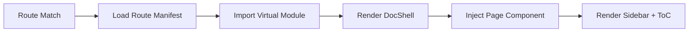

# Clarify Core — Documentation Engine Design

## Overview

The **Clarify Core** is the engine inside `packages/vite-plugin` that transforms raw MDX and OpenAPI content into a runnable, navigable documentation site. This document describes the core subsystems, their responsibilities, and the design decisions behind them.

---

## 1. Content Ingestion Pipeline

The engine reads two types of source material:

| Source Type | File Pattern | Parsed By | Output |
|-------------|--------------|-----------|--------|
| MDX Pages | `**/*.mdx` | `@mdx-js/rollup` + custom frontmatter parser | React components + metadata |
| OpenAPI Spec | `openapi.yaml` / `openapi.json` | `swagger-parser` or `openapi-types` | Type-safe API reference data |

### 1.1 MDX Processing Flow

```
MDX File → Frontmatter Extract → MDX Compile → React Component → Route Registration
```

1. **Frontmatter Extract**: Parse YAML frontmatter for metadata (`title`, `description`, `nav_order`, `hidden`, `tags`).
2. **OpenAPI Resource Load**: If an `openApi` spec is configured, the plugin parses it into an internal model and makes it available as a virtual module.
3. **MDX Compile**: Use `@mdx-js/rollup` to compile MDX to a React component. The `<OpenAPI>` component is registered in the MDX scope so authors can embed it anywhere.
4. **Component Wrap**: Wrap with `DocShell` from `@clarify/renderer` (provides layout, nav, ToC).
5. **Route Registration**: Map file path to URL path (e.g., `docs/getting-started.mdx` → `/getting-started`).

### 1.2 OpenAPI Resource Flow

When `openApi` is configured, the plugin parses the spec once at build time and makes it available as a **virtual module** consumed by the `<OpenAPI>` component in MDX pages.

```
OpenAPI Spec (yaml/json)
        │
        ▼
  Schema Validate
        │
        ▼
  Transform to Internal Model
        │
        ▼
  virtual:clarify-openapi (virtual module)
        │
        ▼
  <OpenAPI path="/users/{id}" /> inside any MDX page
```

1. **Schema Validate**: Validate against OpenAPI 3.0/3.1.
2. **Transform**: Flatten operations into an `OpenAPIResource` model keyed by `operationId`.
3. **Virtual Module**: Expose the entire spec via `virtual:clarify-openapi` so the renderer can access it at runtime without a server.
4. **MDX Embed**: Authors use the `<OpenAPI>` component in any MDX page to render any operation, tag, or the full spec.

---

## 2. Routing System

### 2.1 File-Based Routing

The engine uses **convention-based routing** derived from the file system:

```
content/
├── index.mdx           → /
├── getting-started.mdx → /getting-started
├── guides/
│   ├── installation.mdx → /guides/installation
│   └── theming.mdx      → /guides/theming
└── api/
    └── (generated)      → /api/*
```

- **Index files**: `index.mdx` maps to the directory root (`/` or `/guides/`).
- **Dynamic segments**: Not supported in v1; flat + nested static routes only.
- **Hidden pages**: Frontmatter `hidden: true` excludes from nav but keeps route accessible.

### 2.2 Route Manifest

At build time, the plugin generates a **route manifest** (JSON or inline JS) consumed by the client:

```typescript
type RouteManifest = {
  routes: Array<{
    path: string;
    componentPath: string;   // virtual module ID
    meta: PageMeta;          // title, description, etc.
    navOrder?: number;
  }>;
  navTree: NavNode[];        // hierarchical sidebar structure
};
```

This manifest powers:
- **Client-side routing** (React Router or similar)
- **Sidebar navigation** (generated from navTree)
- **Table of Contents** (extracted from headings in MDX)

---

## 3. Rendering System

### 3.1 Page Lifecycle



### 3.2 Virtual Modules

Vite virtual modules are used to inject generated content at build time:

- `virtual:clarify-routes` — exports the route manifest and a `Routes` component.
- `virtual:clarify-api` — exports parsed OpenAPI operations as typed JSON.
- `virtual:clarify-config` — exports resolved plugin options.

```typescript
// Inside the app
import { Routes } from 'virtual:clarify-routes';
import { apiOperations } from 'virtual:clarify-api';
```

### 3.3 Component Mapping

MDX components are mapped to `@clarify/renderer` primitives via an `MDXProvider`:

| MDX Element | Renderer Component |
|-------------|-------------------|
| `h1`–`h6` | Styled headings with anchor IDs |
| `pre > code` | `CodeBlock` (syntax highlighting) |
| `table` | `DataTable` (styled, responsive) |
| `a` | `SmartLink` (internal vs external routing) |
| `img` | `Image` (lazy loading, captions) |
| `<OpenAPI>` | `OpenAPI` (embedded API reference, see §1.2) |
| Custom JSX | User-defined via `components` option |

---

## 4. Theme & Styling Architecture

### 4.1 Design Tokens

Clarify uses **CSS custom properties** for theming, defined in a global stylesheet injected by the plugin:

```css
:root {
  --cl-bg: #ffffff;
  --cl-bg-muted: #f8fafc;
  --cl-text: #0f172a;
  --cl-text-muted: #64748b;
  --cl-border: #e2e8f0;
  --cl-primary: #0ea5e9;
  --cl-primary-muted: #e0f2fe;
  --cl-radius: 0.75rem;
  --cl-font-sans: "Plus Jakarta Sans", system-ui, sans-serif;
  --cl-font-mono: "JetBrains Mono", monospace;
}
```

### 4.2 Dark Mode

- Toggle via `data-theme="dark"` on `<html>`.
- Tailwind CSS `dark:` variants are used in renderer components.
- Preference persisted to `localStorage`, respects `prefers-color-scheme`.

### 4.3 Custom Themes

Users can override tokens via plugin options:

```typescript
// vite.config.ts
clarifyPlugin({
  theme: {
    primary: '#8b5cf6',
    fontSans: '"Inter", sans-serif'
  }
});
```

---

## 5. Search System

### 5.1 Design Goals

- **Fast**: Instant results, no server required.
- **Accurate**: Full-text search across MDX content and OpenAPI descriptions.
- **Small**: Search index generated at build time, loaded on demand.

### 5.2 Implementation Strategy

1. **Index Generation**: At build time, extract text from all MDX pages and OpenAPI operations. Build a compressed inverted index (e.g., using `minisearch` or `flexsearch`).
2. **Client-Side Search**: Load the index as a JSON asset. Execute queries entirely in the browser using a lightweight search library.
3. **UI**: Command palette-style modal (`Cmd+K`) with grouped results (Pages, API, Headings).

### 5.3 Search Index Format

```typescript
type SearchDoc = {
  id: string;
  title: string;
  excerpt: string;
  path: string;
  category: 'page' | 'api' | 'heading';
  headings?: string[];  // for heading-level search
};
```

---

## 6. Developer Experience (DX)

### 6.1 Hot Module Replacement (HMR)

| Change Type | Behavior |
|-------------|----------|
| MDX content edit | Full page HMR, preserves scroll position |
| Frontmatter edit | Rebuilds route manifest, updates nav/ToC |
| OpenAPI spec edit | Regenerates API pages, updates type definitions |
| Renderer component edit | Component-level HMR via Vite |
| Plugin config edit | Requires dev server restart (expected) |

### 6.2 Error Handling

- **MDX syntax errors**: Display a friendly overlay with line numbers (via Vite's error overlay).
- **Invalid OpenAPI**: Show a warning in the console + a fallback page listing validation errors.
- **Missing frontmatter**: Use sensible defaults (title from first `# heading`, auto-generated description).

### 6.3 Build Optimizations

- **Code splitting**: Each MDX page becomes its own chunk for optimal caching.
- **Asset inlining**: Small images inlined as data URIs; large images emitted to `assets/`.
- **Tree shaking**: Renderer components are tree-shakeable (ESM exports, no side effects).
- **Prefetching**: Preload adjacent routes in the nav tree for instant navigation.

---

## 7. Configuration API

The plugin accepts a single options object:

```typescript
type ClarifyPluginOptions = {
  /** Root directory for MDX content. Default: 'source/content' */
  docsRoot?: string;

  /** Path to OpenAPI spec. Parsed once and exposed as virtual:clarify-openapi. Default: undefined */
  openApi?: string;

  /** Base path for the docs site. Default: '/' */
  base?: string;

  /** Theme overrides. Default: {} */
  theme?: Partial<ThemeTokens>;

  /** Languages for i18n. Default: ['en'] */
  locales?: string[];

  /** Custom components to inject into MDX scope. Default: {} */
  components?: Record<string, React.ComponentType>;

  /** Transform frontmatter before processing. */
  transformFrontmatter?: (frontmatter: Record<string, unknown>, path: string) => Record<string, unknown>;
};
```

---

## 8. Plugin Hooks API

Clarify exposes a set of **lifecycle hooks** that allow extensions (e.g. translation, search indexing, versioning) to participate in the build-time content processing pipeline. Hooks are registered via the `clarifyPlugin` options in `vite.config.ts`, not through the native Vite plugin system.

### 8.1 Design Principles

| Principle | Description |
|------|------|
| **Pure functions first** | Hooks receive a context object and return a modified object without mutating the input. |
| **Async support** | All hooks are `async` to allow I/O (e.g. reading translation files). |
| **Composable** | Multiple plugins execute in registration order, chaining output from one to the next. |
| **Fail fast** | A single hook failure aborts the build with an error that names the offending plugin. |

### 8.2 Hook Definitions

```typescript
export type ClarifyHookContext = {
  /** Resolved project configuration */
  config: ResolvedClarifyOptions;
  /** Vite config for this build */
  viteConfig?: ResolvedConfig;
};

export type ClarifyPage = {
  path: string;
  filePath: string;
  frontmatter: Record<string, unknown>;
  content: string;
};

export type ClarifyHooks = {
  /**
   * Called after all MDX files have been scanned.
   * Allows modifying the page list (add/remove/reorder), injecting virtual pages, or reordering routes.
   */
  'pages:resolved'?: (
    pages: ClarifyPage[],
    ctx: ClarifyHookContext
  ) => Promise<ClarifyPage[]> | ClarifyPage[];

  /**
   * Called before a single MDX file is compiled.
   * Allows modifying frontmatter or raw content (e.g. injecting translated text).
   */
  'page:transform'?: (
    page: ClarifyPage,
    ctx: ClarifyHookContext
  ) => Promise<ClarifyPage> | ClarifyPage;

  /**
   * Called after the route manifest is generated.
   * Allows modifying navTree, adding redirects, or injecting external links.
   */
  'routes:resolved'?: (
    routes: RouteItem[],
    navTree: NavNode[],
    ctx: ClarifyHookContext
  ) => Promise<{ routes: RouteItem[]; navTree: NavNode[] }> | { routes: RouteItem[]; navTree: NavNode[] };

  /**
   * Called before virtual modules are generated.
   * Allows injecting additional virtual modules for MDX pages or the renderer to consume.
   */
  'modules:before'?: (
    modules: Map<string, string>,
    ctx: ClarifyHookContext
  ) => Promise<Map<string, string>> | Map<string, string>;

  /**
   * Called after the dev server starts / build completes.
   * Suitable for side effects like generating search indexes or translation maps.
   */
  'build:done'?: (ctx: ClarifyHookContext) => Promise<void> | void;
};

export type ClarifyPlugin = {
  /** Plugin name, used for error tracing */
  name: string;
  /** Hooks to register */
  hooks: Partial<ClarifyHooks>;
};
```

### 8.3 Registration

```typescript
// vite.config.ts
import { clarifyPlugin } from '@clarify/vite-plugin';
import { i18nPlugin } from '@clarify/plugin-i18n';
import { searchPlugin } from '@clarify/plugin-search';

export default defineConfig({
  plugins: [
    clarifyPlugin({
      docsRoot: 'source/content',
      plugins: [
        i18nPlugin({ defaultLocale: 'zh-CN' }),
        searchPlugin(),
      ],
    }),
  ],
});
```

### 8.4 Example: Documentation Translation Plugin

```typescript
// @clarify/plugin-i18n
export function i18nPlugin(options: { defaultLocale: string }): ClarifyPlugin {
  return {
    name: 'clarify:i18n',
    hooks: {
      async 'pages:resolved'(pages, ctx) {
        // Generate locale copies for each page
        const translated: ClarifyPage[] = [];
        for (const page of pages) {
          const locale = page.frontmatter.locale ?? options.defaultLocale;
          const t = await loadTranslations(locale, page.filePath);
          translated.push({
            ...page,
            path: `/${locale}${page.path}`,
            content: applyTranslations(page.content, t),
          });
        }
        return [...pages, ...translated];
      },
    },
  };
}
```

### 8.5 Example: Search Index Plugin

```typescript
// @clarify/plugin-search
export function searchPlugin(): ClarifyPlugin {
  return {
    name: 'clarify:search',
    hooks: {
      async 'build:done'(ctx) {
        const index = await buildSearchIndex(ctx.config.docRoot);
        await writeFile('dist/search-index.json', JSON.stringify(index));
      },
    },
  };
}
```

---

## 9. Future Roadmap

| Feature | Priority | Notes |
|---------|----------|-------|
| Full-text search | High | Build-time index + client-side search |
| Versioned docs | High | Multiple doc versions, switcher UI |
| i18n (i18next) | Medium | Multi-language content, locale switcher |
| Plugin API | Medium | Third-party plugins for custom content types |
| React Server Components | Low | Investigate for static generation phase |
| AI-powered search | Low | Optional enhancement for large docs |

---

## 9. Dependencies & Integration Points

### Runtime Dependencies

| Package | Purpose |
|---------|---------|
| `vite` | Plugin API, dev server, build pipeline |
| `@mdx-js/rollup` | MDX compilation |
| `react` / `react-dom` | UI framework |
| `react-router-dom` | Client-side routing (or TanStack Router) |

### Build-Time Dependencies

| Package | Purpose |
|---------|---------|
| `gray-matter` | Frontmatter parsing |
| `swagger-parser` | OpenAPI validation |
| `minisearch` / `flexsearch` | Search index generation |
| `tsup` | Package builds |

### Peer Dependencies

| Package | Notes |
|---------|-------|
| `react` | ^19.0.0 (renderer is React-only) |
| `vite` | ^7.0.0 (plugin requires Vite) |
