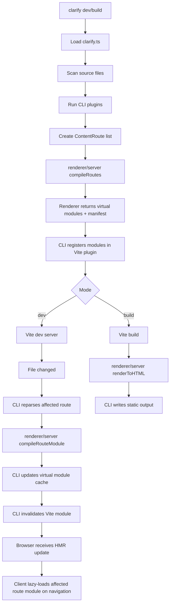
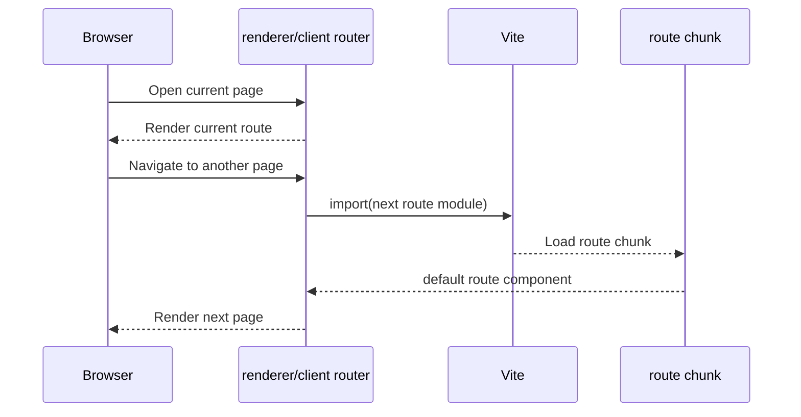
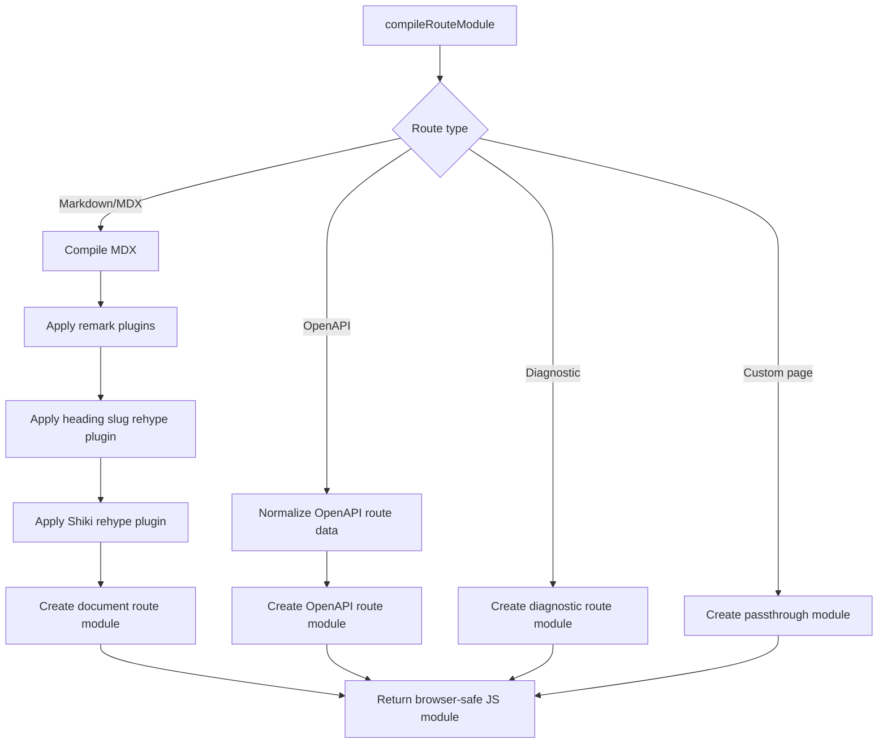
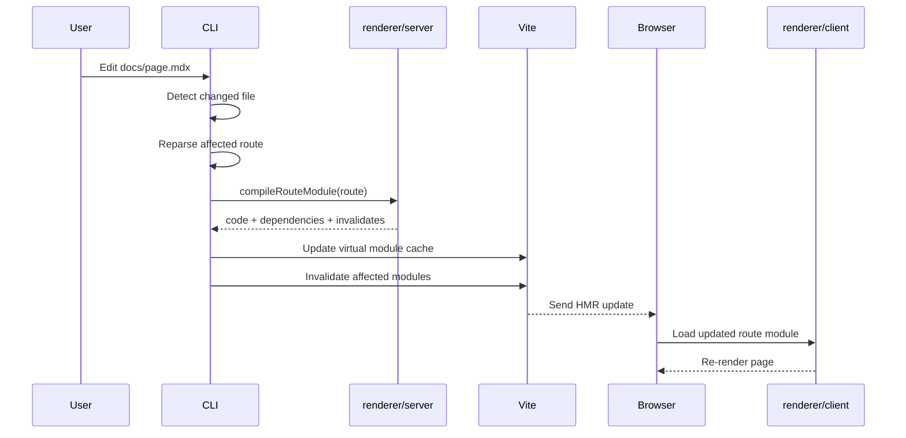
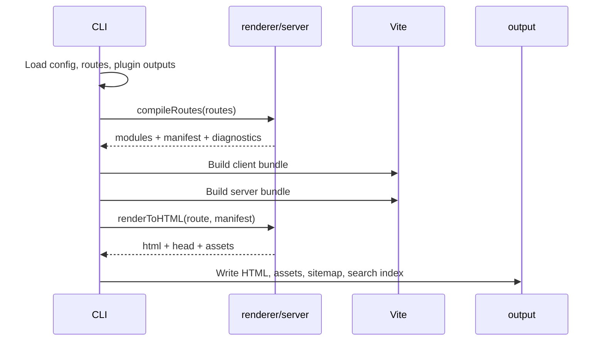

# Renderer 接管 Route Module 生成

## 状态

架构评审草案。

## 决策摘要

Clarify 应该演进为 **renderer 接管 route module 生成**，同时继续让 CLI 负责项目编排和 Vite 生命周期。

一句话原则：

```txt
CLI owns the project pipeline.
Renderer owns the rendering pipeline.
```

也就是说，CLI 负责发现文件、加载配置、执行插件、管理 Vite、写入输出目录。renderer 负责决定内容路由如何变成浏览器模块、SSR HTML、诊断信息、样式和可交互的 React 组件。

## 产品目标

| 目标 | 含义 | 架构要求 |
| --- | --- | --- |
| 文档渲染一致性 | Markdown、MDX、OpenAPI、代码块、锚点和样式在 dev、build、SSR、client runtime 下行为一致。 | 渲染规则必须集中在 renderer。 |
| 灵活的构建目标 | Clarify 应支持 client render、SSR、静态输出，以及未来自定义托管/构建集成。 | renderer 需要 Node-side server entry，而不只是浏览器组件库。 |
| 更快的首屏打开速度 | 首次进入站点时，不应同步加载所有页面的 route module。 | 路由级代码分割和页面懒加载必须是默认能力。 |
| CLI 保持轻量 | CLI 应保持项目编排器定位。 | CLI 不应该编译 MDX、不应该做代码高亮、不应该构造 React 页面模块。 |
| 可扩展插件体系 | 插件可以生成内容、slot 和 metadata，但不能绕过核心渲染管线。 | 插件产物应进入稳定的 route/content model，再交给 renderer 消费。 |
| 降低运行时错误 | 浏览器 runtime 不应该 evaluate MDX，也不应该导入 Shiki 这类 Node-only 工具。 | `renderer/client` 和 `renderer/server` 必须有严格运行时边界。 |

## 要解决的问题

| 问题 | 当前表现 | 根因 | 目标架构 |
| --- | --- | --- | --- |
| 锚点丢失 | `h2`/`h3` 标题失去稳定 id。 | heading slug 逻辑没有稳定应用在 route compilation 阶段。 | `renderer/server` 负责生成 heading slug。 |
| 代码高亮丢失 | 代码块没有 Shiki 高亮结果。 | 高亮没有稳定在 Node 阶段执行。 | `renderer/server` 执行 Shiki，并序列化安全的 HTML/props。 |
| Markdown/OpenAPI 样式漂移 | Markdown 和 OpenAPI route 可能走不同渲染路径。 | 渲染职责分散在 CLI、generated modules 和 client runtime。 | renderer 生成所有内容 route module。 |
| 首屏加载过重 | 首次打开时同步加载过多页面代码。 | route module 默认被整体打包或过早执行。 | route module 应支持按页面懒加载。 |
| 浏览器 import/runtime 错误 | dev 中出现 Shiki、MDX evaluate、JSX virtual module parse、CJS `require` 等问题。 | Server-only 编译能力泄漏到浏览器模块或 CLI output。 | 生成的浏览器模块只 import `@clarify-labs/renderer/client`。 |
| CLI/renderer 职责重叠 | CLI 创建页面模块，renderer 又定义 route component。 | 渲染管线没有单一 owner。 | CLI 编排，renderer 渲染。 |
| SSR 价值没有发挥 | SSR 存在，但不拥有 compile/render pipeline。 | SSR 被当作 `renderToString` helper，而不是 Node-side 渲染能力。 | `renderer/server` 拥有 route compilation、SSR HTML 和 render metadata。 |

## 选择的方案

当前选择是方案 B：**renderer-owned route module generation, CLI-owned Vite lifecycle**。

| 层 | 负责 | 不负责 |
| --- | --- | --- |
| CLI | 命令、配置加载、source 扫描、插件执行、Vite dev/build、virtual module 注册、HMR invalidation、输出写入。 | MDX 编译、Shiki 高亮、OpenAPI React 页面生成、route component 构造。 |
| `@clarify-labs/renderer/server` | Node-side route 编译、MDX/OpenAPI module 生成、heading slug、代码高亮、diagnostics、SSR HTML、renderer manifest。 | 文件监听、source 目录扫描、CLI 命令行为、Vite server 所有权。 |
| `@clarify-labs/renderer/client` | 浏览器渲染、hydration、route components、slots、theme runtime、交互组件、懒加载页面装配。 | Node-only 编译、Shiki、文件系统访问、SSR-only API。 |

## 与 Vite 的集成原则

这套设计不应该把 Vite 当成“静态资源打包工具”，而应该把它当成 Clarify 的底层模块系统、开发服务器和构建图执行器。

原则是：

```txt
Clarify defines route semantics.
Vite executes the module graph.
```

也就是说，Clarify 负责定义“什么是一个 route、它依赖什么、它应该产出什么页面语义”；Vite 负责把这些语义映射成 dev server 可热更新的模块图，以及 build 阶段的 chunk、asset 和 manifest。

### 哪些问题应该优先交给 Vite 处理

| 问题 | Clarify 负责定义 | Vite 负责执行 |
| --- | --- | --- |
| 页面懒加载 | 哪些 route 应按页面级动态加载。 | 把动态 import 变成真实 route chunk，并处理 chunk graph。 |
| HMR 失效范围 | route 依赖、slot 依赖、layout 依赖、OpenAPI artifact 依赖。 | 根据模块图和 importers 精确 invalidation，而不是全量刷新。 |
| 构建产物资源映射 | route 对应哪个 virtual module、哪类页面语义。 | 产出真实的 JS/CSS/assets，并通过 manifest 暴露映射。 |
| SSR 资源注入 | 页面需要哪些 entry/module 语义。 | 通过 build manifest / SSR manifest 提供最终资源路径。 |
| 开发态模块服务 | route、slot、runtime config 的语义来源。 | 通过 dev server 解析 virtual modules、动态 import 和中间件资源请求。 |
| HTML 注入 | 页面 head、body、renderer 结果和 runtime config。 | 通过 `transformIndexHtml` 和构建 HTML pipeline 处理注入与差异收敛。 |

### Clarify 不应该自己重复实现的能力

以下能力应尽量交给 Vite，而不是在 CLI 或 renderer 里再造一套并行机制：

| 不该重复实现的东西 | 原因 |
| --- | --- |
| route chunk 文件名和依赖关系推导 | 这是 bundler 的职责。Clarify 只应知道 route 对应哪个 module，不应自己猜 chunk 路径。 |
| 动态 import 资源 URL 拼接 | Vite 已经知道 base、hash、code split 和 dev/build 差异。 |
| CSS/JS asset 注入规则 | 应统一由 Vite build 产物和 manifest 驱动。 |
| 热更新传播链 | Vite 已维护 module graph 和 importer graph，不应由 Clarify 手写一套传播规则。 |
| HTML 中 dev/build 入口差异 | 交给 Vite 的 HTML transform pipeline 比手工拼接更稳定。 |

### Clarify 必须自己定义、不能交给 Vite 的语义

Vite 擅长执行模块图，但它并不理解文档站点语义。这些部分仍然必须由 Clarify 明确定义：

| Clarify 仍需拥有的语义 | 原因 |
| --- | --- |
| 什么是 `ContentRoute` | Vite 不理解 Markdown、OpenAPI、diagnostic route 的差别。 |
| route payload 结构 | Vite 不负责定义内容模型、metadata、sections 或 OpenAPI normalized data。 |
| route compile 依赖关系 | 哪些文件、artifact、slot 或配置会影响某页，只有 Clarify 知道。 |
| 搜索和可索引正文边界 | Vite 不理解 `data-pagefind-ignore` 或正文容器语义。 |
| 多语言 alias / fallback / canonical 关系 | 这是站点路由语义，不是 bundler 语义。 |
| diagnostic 降级规则 | 编译失败时页面如何回退，是 Clarify 的产品行为。 |

### 更合理的集成方式

在这套架构里，最理想的投影关系应是：

```txt
Clarify route model
  -> Vite virtual modules
  -> Vite module graph
  -> Vite manifest / SSR manifest
  -> renderer/server uses those build outputs to inject final assets
```

这个顺序很重要，因为它决定了 Clarify 不应直接面向“chunk 文件”做设计，而应面向“module 语义”做设计。

### 对当前设计缺口的直接帮助

如果沿着这个方向继续收敛，前面那些尚未完全解决的问题会变得更容易处理：

| 设计缺口 | 通过与 Vite 更好结合后的解法 |
| --- | --- |
| Route manifest 过于抽象 | Clarify manifest 只表达 route 语义；真实 chunk/css/asset 映射交给 Vite manifest。 |
| 失效边界不清晰 | Clarify 返回 `dependencies` / `invalidates`；Vite module graph 执行精确失效传播。 |
| 页面懒加载实现边界模糊 | Clarify 决定页面级动态 import；Vite 决定 chunk 切分和加载路径。 |
| 资源路径和 routePrefix 风险 | 统一依赖 Vite 的 base 和产物映射，不在 renderer/client 手工拼 URL。 |
| dev/build 行为漂移 | dev 走 Vite dev server；build 走 Vite manifest/SSR manifest，两边都以同一组 virtual modules 为输入。 |

### 建议的硬约束

为了避免职责重新混乱，建议把下面几条当成硬规则：

```txt
Clarify owns route meaning.
Vite owns module execution.
Clarify must not guess final chunk URLs.
Renderer must not bypass Vite's module graph.
```

只要保持这几条规则，Clarify 就能利用 Vite 的成熟能力，而不是在 route module、SSR 和懒加载演进过程中逐步长出第二套 bundler。

## 模块边界定义

如果要真正把这套设计落地，不能只定义“包边界”，还必须定义“模块边界”。

这里的模块边界，指的是：

1. 哪些模块类型存在。
2. 哪些模块可以进入 Vite 的模块图。
3. 哪些模块只能留在 Node 侧。
4. 哪些 import 方向是允许的，哪些是禁止的。

结合 Vite，最重要的原则是：**只有浏览器安全的模块才能进入 client module graph；只有与构建/SSR 执行直接相关的模块才能进入 server module graph。**

### 模块类型

在当前设计里，建议把模块明确分成下面几类：

| 模块类型 | 例子 | 是否进入 Vite client graph | 是否进入 Vite server graph | 说明 |
| --- | --- | --- | --- | --- |
| Project source modules | 用户自己的页面、slot 组件、theme 组件、应用级代码。 | 是 | 是 | 这是用户项目源码，由 Vite 常规处理。 |
| Clarify virtual runtime modules | `virtual:clarify/config`、`virtual:clarify/routes`、`virtual:clarify/slots`、`virtual:clarify/entry-client`。 | 是 | 部分是 | 这些模块由 CLI 生成，但它们的执行交给 Vite。 |
| Route virtual modules | `virtual:clarify/route/*` 这类按页面生成的 route module。 | 是 | 是 | 这是 renderer/server 编译后的浏览器安全模块，是 route 级代码分割边界。 |
| Renderer client modules | `@clarify-labs/renderer/client` 导出的 render、hydrate、route components、slots、theme runtime。 | 是 | 是 | 它们必须 browser-safe，既能 hydrate，也能被 SSR bundle import。 |
| Renderer server modules | `@clarify-labs/renderer/server` 的 compile/render API。 | 否 | 是 | 只能在 Node 侧执行，不能进入浏览器 bundle。 |
| CLI orchestration modules | config 加载、source 扫描、plugin orchestration、watcher、output writer。 | 否 | 否 | 它们属于 CLI 进程本身，不应进入 Vite runtime graph。 |
| Build artifact modules | build manifest、SSR manifest、Pagefind 输出、静态 HTML。 | 否 | 否 | 它们是 Vite/CLI 的输出，不是运行时 import module。 |

### 两张图，不是一张图

这里必须明确 Clarify 最终会同时面对两张不同的 Vite 模块图：

| 图 | 用途 | 应包含哪些模块 |
| --- | --- | --- |
| Client module graph | 浏览器首屏、懒加载导航、hydration、交互 UI。 | project source、Clarify virtual runtime modules、route virtual modules、renderer/client。 |
| Server module graph | SSR render、静态输出、server-side route execution。 | project source、route virtual modules、renderer/client、renderer/server 的 SSR/compile entry。 |

关键点在于：route virtual module 可以同时进入 client graph 和 server graph，但 `renderer/server` 本身不能进入 client graph。

### 允许的 import 方向

如果从 import 规则来定义边界，建议把下面这些方向视为允许的主路径：

```txt
CLI orchestration
  -> renderer/server
  -> Vite virtual modules

Vite virtual runtime modules
  -> route virtual modules
  -> renderer/client
  -> project source modules

route virtual modules
  -> renderer/client
  -> project source modules (only when explicitly intended and browser-safe)

renderer/server
  -> renderer/client (for shared render-time types/contracts only when needed)
```

对应到真实职责上，可以理解为：

1. CLI 调用 `renderer/server` 生成 route module。
2. CLI 把 route module 暴露成 Vite virtual module。
3. Vite 用这些 virtual module 建立 client/server module graph。
4. route module 在运行时只依赖 browser-safe 的 `renderer/client` 和必要的项目源码。

### 禁止的 import 方向

下面这些方向应该被视为硬性禁止：

```txt
route virtual modules -> renderer/server
renderer/client -> renderer/server
project source modules running in browser -> renderer/server
Vite client graph modules -> CLI orchestration modules
build artifacts -> imported back into runtime modules
```

原因分别是：

| 禁止方向 | 为什么必须禁止 |
| --- | --- |
| route module -> `renderer/server` | 会把 Node-only compile/render API 泄漏进浏览器 bundle。 |
| `renderer/client` -> `renderer/server` | 会破坏 browser-safe 保证，导致 client runtime 意外携带 Node-only imports。 |
| browser-side project source -> `renderer/server` | 用户组件一旦误用 server API，会制造 dev 可跑、build 崩溃这类边界错误。 |
| Vite graph -> CLI orchestration | watcher、config loader、output writer 不是 runtime 依赖，不能反向进入模块图。 |
| build artifacts -> runtime import | manifest、HTML、Pagefind 输出属于产物，不应反向成为运行时依赖。 |

### 与 Vite 的真实对接边界

如果结合 Vite 去落地，这些模块的边界可以进一步收敛成下面的方式：

| 边界 | Clarify 提供 | Vite 提供 |
| --- | --- | --- |
| Virtual module boundary | virtual id、module source、route 语义。 | resolve/load、module graph、HMR、chunk graph。 |
| Dynamic import boundary | 哪些 route 按页面懒加载。 | 动态 import 的实际切分与产物路径。 |
| SSR execution boundary | 哪些 route module 可在 server graph 执行。 | SSR build、SSR manifest、server-side module resolution。 |
| HTML output boundary | `renderToHTML` 的语义结果。 | HTML 构建流程、资源注入、产物路径绑定。 |

这意味着 Clarify 不应该设计“一个独立于 Vite 的 route runtime”，而应该把 route system 尽量表达为 Vite 原生能理解的 virtual modules 和 dynamic imports。

### 最小可执行模块边界规则

如果要把这部分收敛成可以执行的规则，我建议至少写死下面几条：

```txt
1. CLI only orchestrates; it never becomes a Vite runtime module.
2. renderer/server is Node-only; it never appears in client imports.
3. route virtual modules are the only compile-to-runtime bridge.
4. route virtual modules may import renderer/client, but never renderer/server.
5. Vite manifests own final asset resolution; Clarify owns route semantics only.
```

这五条其实就是“结合 Vite 后的模块边界定义”。它们一旦成立，后面的懒加载、SSR、HMR、Pagefind、静态输出都会更容易沿着同一条模块边界演进。

## 包边界

```txt
@clarify-labs/cli
  Project pipeline:
  - load clarify.ts
  - scan source files
  - run plugins
  - create route/content models
  - register Vite virtual modules
  - handle HMR invalidation
  - write build output

@clarify-labs/renderer/server
  Rendering pipeline in Node:
  - compile route modules
  - compile MDX blocks
  - generate heading anchors
  - run Shiki highlighting
  - generate OpenAPI route modules
  - generate diagnostic modules
  - render SSR HTML
  - create renderer manifest

@clarify-labs/renderer/client
  Browser runtime:
  - render and hydrate
  - lazy route loading
  - route components
  - MDX component provider
  - slots
  - theme runtime
  - interactive UI components

Future @clarify-labs/core
  Shared protocol:
  - content model
  - route model
  - resolved config model
  - plugin output model
  - diagnostics
```

## Server 公开 API

server entry 应暴露 route-oriented API，但输入应当是 **CLI 已经准备好的标准化内容**。也就是说，renderer/server 负责编译，不负责再去读文件、解析模块或理解项目目录。

```ts
export type RendererCompileOptions = {
  mode: 'development' | 'production'
  target: 'client' | 'ssr' | 'static'
}

export type RendererRoutePayload =
  | {
      kind: 'document'
      document: ContentDocument
    }
  | {
      kind: 'openapi'
      document: OpenApiDocument
    }
  | {
      kind: 'diagnostic'
      diagnostic: ContentDiagnostic
    }

export type CompileRouteModuleInput = {
  route: ContentRoute
  payload: RendererRoutePayload
  config: ResolvedProjectConfig
  options: RendererCompileOptions
}

export type CompileRouteModuleResult = {
  id: string
  code: string
  dependencies: string[]
  invalidates?: string[]
  diagnostics?: ContentDiagnostic[]
}

export async function compileRouteModule(
  input: CompileRouteModuleInput,
): Promise<CompileRouteModuleResult>
```

```ts
export type CompileRoutesInput = {
  routes: Array<{
    route: ContentRoute
    payload: RendererRoutePayload
  }>
  config: ResolvedProjectConfig
  options: RendererCompileOptions
}

export type CompileRoutesResult = {
  modules: Map<string, string>
  diagnostics: ContentDiagnostic[]
  manifest: RendererManifest
}

export async function compileRoutes(
  input: CompileRoutesInput,
): Promise<CompileRoutesResult>
```

```ts
export type RenderToHTMLInput = {
  entry: string
  route: ContentRoute
  manifest: RendererManifest
  config: ResolvedProjectConfig
}

export type RenderToHTMLResult = {
  html: string
  head: string[]
  assets: RendererAsset[]
  diagnostics: ContentDiagnostic[]
}

export async function renderToHTML(
  input: RenderToHTMLInput,
): Promise<RenderToHTMLResult>
```

## Client 公开 API

client entry 只应暴露浏览器安全的渲染 API。

```ts
export function render(options: RenderOptions): void

export function hydrate(options: HydrateOptions): void

export function createLazyRouteComponent(
  loader: () => Promise<{ default: React.ComponentType }>,
): React.ComponentType

export function createDocumentRouteComponent(
  input: DocumentRouteComponentInput,
): React.ComponentType

export function createOpenApiRouteComponent(
  input: OpenApiRouteComponentInput,
): React.ComponentType

export function createContentDiagnosticComponent(
  diagnostic: ContentDiagnostic,
): React.ComponentType

export function useSlot(name: UISlotName): React.ReactNode

export function useMDXComponents(): MDXComponents
```

client runtime 应把页面懒加载视为默认交付方式：当前路由页面之外的 route module 应通过动态 import 按需加载，而不是在首屏同步执行。

## Server/Client 渲染契约

Server-only 逻辑和 client hydration 不会执行同一条完整 pipeline。它们共享的是同一份 **编译后的渲染输入**，以及同一套浏览器安全的 React 组件。

契约如下：

```txt
Source content
  -> renderer/server compile phase
  -> browser-safe route module
  -> server render and client hydrate both consume that module
```

Node-only 逻辑只允许出现在 route module 边界之前。这里的前提是：文件读取、source 扫描、插件执行、原始内容解析由 CLI 完成；renderer/server 接收到的已经是标准化 payload。

| 层 | 运行时 | 示例 | 浏览器 hydration 是否执行 |
| --- | --- | --- | --- |
| Compile-time logic | 仅 Node | MDX compile、Shiki、heading slug generation、基于已提供 payload 的 OpenAPI route 编译。 | 否。 |
| Compiled rendering input | Node 生成，server 和 browser 共同消费 | Route module、serialized route data、compiled MDX components、`highlightedHtml`、heading ids、normalized OpenAPI data。 | 是。 |
| Render-time components | Server 和 browser | Document shell、Markdown components、`Code`、OpenAPI components、slots、theme-aware UI。 | 是。 |

这意味着 server 和 client 不会都运行 Shiki、MDX compilation 或 route module generation。CLI 先把 route 和 payload 准备好，再由 `renderer/server` 统一执行编译，并把结果序列化进 route module。SSR 和 hydration 随后执行同一个 route module 和同一套 browser-safe renderer components。

例如代码高亮应该这样流动：

```txt
Markdown code block
  -> renderer/server runs Shiki
  -> route module contains highlightedHtml
  -> server and client both render <Code highlightedHtml="..." />
```

`Code` 组件是共享的 render-time logic。Shiki 是 compile-time logic。

## Route Module 形态

route module 是 Node-only 编译和共享渲染之间的边界产物。它必须能被 SSR bundle 和 browser bundle 安全 import。

概念上，一个编译后的内容 route 应该类似这样：

```ts
import { jsx as _jsx } from 'react/jsx-runtime'
import {
  createComponentRouteComponent,
  renderContentDocument,
} from '@clarify-labs/renderer/client'

export const routeData = {
  contentDocument: {
    content: [/* serialized blocks */],
    metadata: {
      sections: [/* ids generated by renderer/server */],
    },
  },
}

function MarkdownBlock0() {
  return _jsx('h2', { id: 'install', children: 'Install' })
}

const markdownComponents = [MarkdownBlock0]

function PageContent() {
  let markdownIndex = 0

  return renderContentDocument(routeData.contentDocument, {
    markdown() {
      const MarkdownComponent = markdownComponents[markdownIndex++]
      return MarkdownComponent ? _jsx(MarkdownComponent, {}) : null
    },
  })
}

export default createComponentRouteComponent({ component: PageContent })
```

这个形态是有意设计的：

| 选择 | 原因 |
| --- | --- |
| module import `renderer/client`。 | 它必须 browser-safe，并且可以 hydrate。 |
| module 不 import `renderer/server`。 | Node-only 编译能力不能进入 browser bundle。 |
| module 包含 compiled MDX components。 | 浏览器执行的是编译后的 React components，不是 MDX compiler。 |
| module 序列化 route data。 | Server render 和 client hydrate 消费同一份数据。 |
| `markdownIndex` 作用域在 `PageContent` 内部。 | React Refresh 和重复 render 不能消耗 module-level mutable state。 |

上面这段代码展示的是“单个 route module 内部的内容形态”。在站点运行时，这些 route module 不应该默认一次性全部进入首屏包。更合理的交付方式是：每个内容页面对应独立 route chunk，由 client router 在导航时动态 import。

概念上，client 侧的路由装配应类似这样：

```ts
const routes = [
  {
    path: '/getting-started',
    component: createLazyRouteComponent(() => import('virtual:clarify/route/getting-started')),
  },
  {
    path: '/reference',
    component: createLazyRouteComponent(() => import('virtual:clarify/route/reference')),
  },
]
```

这里的懒加载边界是“页面级 route module”，而不是把一个页面内部的 Markdown block 再切成多个异步片段。前者能明显改善首屏加载，后者会让文档渲染时序和滚动体验变复杂。

## 接口评审

以这个契约来看，当前接口方向是合理的，但最终版本需要在命名和分层上继续收敛。

| 接口 | 评估 | 最终方向 |
| --- | --- | --- |
| `renderer/server compileContentDocumentPage` | 作为 phase-1 compiler 可用，但对最终 B 方案来说过于 document-specific，而且输入边界仍偏实现细节。 | 提升为 route-level `compileRouteModule`，并统一为 CLI 提供 payload、renderer 只消费 payload。 |
| `renderer/client createComponentRouteComponent` | 很适合。它允许 generated module 提供已经编译好的 page component。 | 保留，作为 route module bridge。 |
| `renderer/client createLazyRouteComponent` | 对页面级代码分割是必要的。懒加载不应该散落在 CLI 或应用壳层里各自实现。 | 新增，作为页面级按需加载桥。 |
| `renderer/client renderContentDocument` | 很适合。它把 document shell、section provider 和 block rendering 留在 renderer/client。 | 保留，作为共享 render-time logic。 |
| `renderer/client createDocumentRouteComponent` | 对兼容和简单 data-only route 仍有价值。 | 保留，但 MDX block 已预编译的 compiled routes 应优先使用 component routes。 |
| Generated module imports from `renderer/client` | 正确。这是关键 browser-safe 边界。 | 设为硬性规则。 |
| `RendererBuildContext` 这类带 IO/解析能力的上下文 | 容易让 renderer 重新承担 CLI 的工程职责。 | 删除，改为显式 `payload + options` 输入。 |
| Server API returning only `{ code }` | 对 phase 1 足够，但对 HMR/SSR/build metadata 不够。 | 最终结果应包含 `id`、`dependencies`、`invalidates`、`diagnostics`，后续再加入 manifest metadata。 |

## Generated Module 规则

所有由 `renderer/server` 生成的浏览器 route module 都必须只从 `renderer/client` import。

```txt
Allowed:
  import { createDocumentRouteComponent } from '@clarify-labs/renderer/client'

Forbidden:
  import { compileRouteModule } from '@clarify-labs/renderer/server'
  import { renderToHTML } from '@clarify-labs/renderer/server'
  import shiki from 'shiki'
  import { compile } from '@mdx-js/mdx'
```

Generated modules 应该是普通 JavaScript，Vite 不需要依赖 `.jsx` 或 `.tsx` 文件扩展名也能解析。如果未来重新引入 JSX output，virtual module transform pipeline 必须显式支持 JSX。

Generated modules 可以包含 Node-only 工作的产物，例如 highlighted HTML 或 normalized OpenAPI data。但它们不能包含 Node-only imports 或 runtime calls。

## CLI 调用流程



## 页面懒加载流程



## Renderer 内部流程



## HMR 流程



## Build 和 SSR 流程



## 搜索与 Pagefind

Pagefind 在这套架构里是可兼容的，但它会强依赖一个前提：**搜索索引必须基于稳定的静态 HTML 产物生成，而不是依赖客户端导航后才出现的 DOM**。

这意味着：

1. 页面懒加载不会天然破坏 Pagefind。
2. 真正的风险点在于索引生成时机和索引输入来源。
3. 搜索系统应建立在 build/SSR 产物之上，而不是 client runtime 行为之上。

在当前模式下，Pagefind 的合理数据流应是：

```txt
CLI prepares routes and payloads
  -> renderer/server compiles routes
  -> renderer/server renders stable HTML per route
  -> CLI writes HTML files
  -> CLI runs Pagefind on written output
```

这条链路里，Pagefind 消费的是最终输出目录中的 HTML，而不是 route module 本身，也不是浏览器里懒加载后的 React 树。

### Pagefind 在现有模式下的关键要求

| 要求 | 原因 |
| --- | --- |
| 搜索索引必须基于静态 HTML 输出生成。 | Pagefind 读取的是页面内容，而不是 React route module。 |
| 每个内容页面在 build 后都必须有独立、完整、可抓取的 HTML。 | 页面懒加载只影响浏览器导航，不应影响搜索索引输入。 |
| SSR/静态渲染输出的正文结构必须稳定。 | 否则同一页面在搜索结果、首屏 HTML、hydrate 后内容之间会出现漂移。 |
| 标题锚点必须在 server compile/render 阶段稳定生成。 | 搜索结果跳转到 H2/H3 章节依赖稳定 anchor。 |
| `data-pagefind-ignore` 的边界必须由 renderer shell 明确维护。 | Header、导航、按钮、主题切换等非正文 UI 不应污染全文索引。 |
| 多语言页面必须输出彼此隔离的静态路径和索引。 | 否则 Pagefind 结果会混淆不同 locale。 |

### 在这个新架构下最容易忽略的 Pagefind 风险

| 风险 | 说明 | 规避方式 |
| --- | --- | --- |
| 只验证了 client 导航，没验证静态 HTML | 浏览器里页面能打开，不代表输出 HTML 已包含完整正文。 | 把“输出 HTML 可被 Pagefind 抓取”作为 build 验收条件。 |
| 搜索索引依赖 hydration 后内容 | 如果正文要等客户端执行后才完整，Pagefind 会漏抓内容。 | 正文内容必须在 SSR/静态输出阶段完整落盘。 |
| 懒加载和搜索被混为一层 | 页面懒加载是交付策略，Pagefind 是离线索引流程，两者不应互相依赖。 | 明确搜索基于 output HTML，懒加载只面向浏览器 runtime。 |
| 搜索结果锚点失效 | 如果 sections/slug 在 server 和 client 间不一致，搜索跳转会落空。 | heading id 必须由 renderer/server 统一生成并写入最终 HTML。 |
| OpenAPI 页面的索引内容不稳定 | 如果 OpenAPI route 的正文结构在不同模式下不一致，摘要质量会下降。 | OpenAPI route 也必须走统一的 server compile + render 流程。 |
| 壳层 UI 混入正文索引 | 搜索结果可能命中导航、按钮文案、主题切换文案。 | 由 renderer 统一定义可索引正文容器和 `data-pagefind-ignore` 策略。 |

### 对设计边界的直接影响

Pagefind 进一步证明了当前边界应该保持如下分工：

| 层 | 对搜索的职责 |
| --- | --- |
| CLI | 在 build 后对输出目录运行 Pagefind；管理索引生成时机、输出位置和多语言隔离。 |
| `renderer/server` | 负责生成稳定、完整、可抓取的页面 HTML，以及稳定的章节锚点和正文结构。 |
| `renderer/client` | 负责搜索 UI、客户端导航、结果跳转体验，但不负责决定索引内容来源。 |

换句话说，Pagefind 不应该读取 route payload，不应该依赖浏览器里的懒加载页面，也不应该从 client runtime 回收内容。它只应该读取最终产出的 HTML。

### 设计结论

如果 Clarify 要同时支持 SSR、页面懒加载和 Pagefind，那么必须把下面这条规则当成硬约束：

```txt
Search indexes are built from final HTML output, not from lazy-loaded client routes.
```

只要这条规则成立，页面懒加载和 Pagefind 是兼容的；如果这条规则被破坏，搜索质量会先于页面渲染质量出问题。

## HMR 支持矩阵

| 变更类型 | 该设计是否支持 | 处理方式 |
| --- | --- | --- |
| Markdown/MDX content | 是 | CLI 重新解析变更文件，并调用 `compileRouteModule`。 |
| OpenAPI spec | 是 | CLI 重新解析 spec，并为受影响 routes 调用 `compileRouteModule`。 |
| 页面导航 | 是 | client router 动态 import 对应 route module，而不是首屏同步加载所有页面。 |
| 搜索索引生成 | 是 | CLI 在最终 HTML 输出完成后运行 Pagefind，而不是等待客户端懒加载。 |
| `clarify.ts` config | 是，但需要更大范围 invalidation | CLI 重新 resolve config，并 invalidate 受影响的 navigation、layout 和 route modules。 |
| Theme config | 是 | CLI invalidate theme/bootstrap modules 和受影响的 layout modules。 |
| Navigation config | 是 | CLI invalidate navigation 和受影响的 route/layout modules。 |
| Renderer client component source | 是 | Vite 处理 workspace package updates。 |
| Renderer server compiler source | 通常需要 restart 或 plugin reload | 这是 Node-side plugin code，不应当成普通页面 HMR。 |
| Plugin code | 取决于 plugin loader | CLI 必须 reload plugin output，并 invalidate 受影响 modules。 |

## 实施阶段

| Phase | 目标 | 工作 | 成功标准 |
| --- | --- | --- | --- |
| Phase 1 | 稳定 server/client 边界 | 保留 `renderer/client` 和 `renderer/server`；把 MDX compile、heading slug 和 Shiki 移入 `renderer/server`。 | 浏览器不再 evaluate MDX 或 import Shiki；锚点和高亮恢复。 |
| Phase 2 | 把 route module generation 移入 renderer | 实现 `compileRouteModule` 和 `compileRoutes`；CLI 调用 renderer，不再构造 React 页面模块。 | CLI 不再手写 route component code。 |
| Phase 3 | 增加 renderer manifest 和 SSR API | 增加基于 compiled route modules 的 `RendererManifest` 和 `renderToHTML`。 | dev、build、SSR 使用同一条 renderer pipeline。 |
| Phase 4 | 抽出共享 core protocol | 把 content、route、config、plugin output、diagnostic 类型移入未来的 `@clarify-labs/core`。 | CLI 和 renderer 依赖共享协议，不再依赖 CLI 私有类型。 |
| Phase 5 | 对外 renderer API | 为非 CLI 集成场景文档化 Node APIs。 | Clarify 既可以作为 CLI，也可以作为 documentation rendering engine 使用。 |

## 设计约束

| 约束 | 原因 |
| --- | --- |
| `renderer/client` 不能 import `renderer/server`。 | 防止 Node-only compiler code 进入 browser bundle。 |
| 生成的浏览器模块只能 import `renderer/client`。 | 保持 virtual modules browser-safe，并且易于 Vite 分析。 |
| CLI 不能手动构造 React route modules。 | 页面渲染结构属于 renderer。 |
| Renderer 不能扫描用户 source 目录，也不应自行读取原始源文件。 | 文件系统所有权和原始内容准备都留在 CLI。 |
| HMR 必须调用 `compileRouteModule`，不能只调用 `compileRoutes`。 | 单页更新不应该要求全站重编译。 |
| 页面级 route module 必须支持动态 import。 | 首屏包不应包含所有页面代码。 |
| 搜索索引必须从最终 HTML 输出生成。 | Pagefind 不能依赖客户端懒加载后才出现的内容。 |
| Build 应调用 `compileRoutes`。 | 完整 build 需要跨所有 routes 的 manifest 和 diagnostics。 |
| SSR 属于 `renderer/server`。 | SSR 是渲染能力，不是 CLI 能力。 |
| Generated modules 必须避免 module-level mutable render state。 | React Refresh 和重复 render 不能消耗一次性数组或队列。 |

## 非目标

本设计暂时不让 renderer 拥有完整 site engine。CLI 仍然负责 Vite、文件监听、插件执行和输出写入。

本设计不要求立即添加 `@clarify-labs/core`。Core extraction 是 route/content/config protocol 稳定后的后续清理。

本设计不要求所有渲染都变成 SSR-only。Client rendering 和 hydration 仍是一等能力；SSR 是新增的 Node-side rendering capability。

## 推荐下一步

下一步具体实现，是把当前 page compiler 形态替换为 route-level APIs：

```ts
compileRouteModule(input)
compileRoutes(input)
```

然后更新 CLI virtual module builder，让它只存储 renderer 生成的 modules 并处理 invalidation。这样可以在不强制完整拆包或重写 site engine 的前提下，把 Clarify 推向目标边界。
