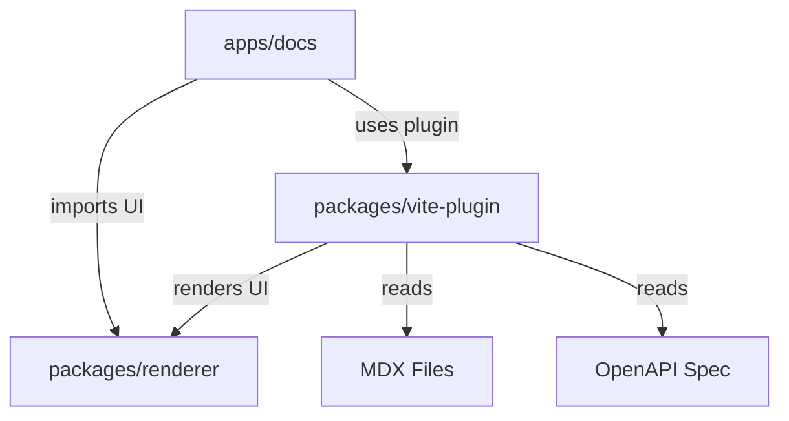

# Clarify Repository Architecture

## Overview

Clarify is a monorepo containing an open-source documentation publishing tool optimized for MDX and OpenAPI. The repository is organized into four main workspaces under `apps/` and `packages/`.

## Monorepo Structure

```
├── apps/
│   ├── docs/           # Documentation playground & dev site (port 5173)
│   └── www/            # Marketing website & landing page (port 5174)
├── packages/
│   ├── renderer/       # Shared React components & UI primitives
│   └── vite-plugin/    # Vite plugin for the Clarify docs engine
```

## Workspace Responsibilities

### `apps/docs` — Documentation Playground
- **Purpose**: Serves as the primary development environment and a live example of the Clarify engine.
- **Key Features**:
  - Consumes `@clarify/renderer` for UI components.
  - Consumes `@clarify/vite-plugin` for MDX/OpenAPI compilation, routing, and dev server integration.
  - Provides a real-world testbed for plugin and renderer changes.
- **Dependencies**: `@clarify/renderer` (workspace), `@clarify/vite-plugin` (workspace).
- **Build Output**: Static site deployed as the official documentation.

### `apps/www` — Marketing Site
- **Purpose**: The public-facing landing page and marketing content for the Clarify project.
- **Key Features**:
  - Independent React + Tailwind CSS application.
  - Showcases features, quick-start guides, and community links.
- **Dependencies**: None from `packages/*` (kept independent for simpler deployment).
- **Build Output**: Static site deployed to the project's public domain.

### `packages/renderer` — Shared React Components
- **Purpose**: Provides reusable, theme-aware React components used by the docs engine.
- **Key Components**:
  - `DocShell`: Layout wrapper for documentation pages (header, navigation shell).
  - `ApiEndpointCard`: Visual component for rendering OpenAPI endpoints (method, path, description).
  - Future: `Sidebar`, `NavTree`, `CodeBlock`, `SearchModal`, `ThemeToggle`.
- **Distribution**: Built with `tsup` (ESM + CJS + DTS) so both Vite (ESM) and other tools (CJS) can consume it.
- **Constraints**: Must remain framework-agnostic outside of React; no Next.js or Vite-specific APIs.

### `packages/vite-plugin` — Vite Plugin
- **Purpose**: The core engine that transforms MDX + OpenAPI into a runnable documentation site.
- **Key Responsibilities**:
  - **MDX Compilation**: Integrates `@mdx-js/rollup` (or equivalent) to compile `.mdx` files into React components.
  - **OpenAPI Ingestion**: Reads `openapi.yaml/json`, generates type-safe API reference pages using `@clarify/renderer` components.
  - **Routing Generation**: Automatically generates a route manifest from the file system (e.g., `docs/getting-started.mdx` → `/getting-started`).
  - **Dev Server**: Provides HMR for MDX content and API spec changes.
  - **Build Integration**: Emits a static, pre-rendered site suitable for deployment.
- **Configuration**: Exposes `ClarifyPluginOptions` (e.g., `docsRoot`) for customization.
- **Distribution**: Built with `tsup` (ESM + CJS + DTS).

## Data Flow



1. **Author** writes MDX docs and OpenAPI specs in `apps/docs/content/`.
2. **`vite-plugin`** scans the content directory, compiles MDX, ingests OpenAPI, and generates routes.
3. **`renderer`** components are imported by the compiled MDX and plugin-generated pages to render the UI.
4. **Vite** bundles everything into a static site.

## Dependency Rules

- **Apps → Packages**: Allowed. Apps depend on packages via `workspace:*`.
- **Packages → Apps**: Forbidden. Packages must remain app-agnostic.
- **Cross-package Dependencies**: Use `workspace:*` in `package.json` and Vite `resolve.alias` for development.
- **External Dependencies**: Prefer well-maintained, lightweight libraries. React ecosystem only.

## Technology Stack

| Layer | Technology | Version | Rationale |
|-------|-----------|---------|-----------|
| Framework | React | 19.x | Latest stable, Concurrent Features, Server Components ready |
| Styling | Tailwind CSS | 4.x | Utility-first, minimal CSS output, design system friendly |
| Build Tool | Vite | 7.x | Fast HMR, optimized production builds, excellent plugin API |
| Language | TypeScript | 5.x | Strict mode, excellent DX, type-safe MDX/OpenAPI ingestion |
| Package Builder | tsup | 8.5.x | Fast ESM/CJS + DTS builds for packages |
| Package Manager | pnpm | 9.x | Workspace-native, deterministic, disk efficient |
| Monorepo | pnpm workspaces | - | Simple, fast, no extra tooling needed |

## Build Order & Development Workflow

### Development (no pre-build required)
Thanks to Vite aliases in `apps/docs/vite.config.ts`, local packages are resolved directly from their `source/` directories. You can run:

```bash
pnpm dev:docs   # starts docs playground
pnpm dev:www    # starts marketing site
```

### Production Build
Packages should be built first, then apps:

```bash
pnpm build      # builds packages first, then apps (pnpm --recursive order)
```

Because `tsup` outputs are in `dist/`, consumers will use the pre-built artifacts in production.

## Future Expansion

| Workspace | Likely Addition |
|-----------|----------------|
| `packages/` | `@clarify/mdx` — MDX parsing primitives (extracted from vite-plugin) |
| `packages/` | `@clarify/openapi` — OpenAPI schema types and transformers |
| `packages/` | `@clarify/theme` — Theme tokens and CSS variable system |
| `apps/` | `playground` — Interactive component sandbox |
