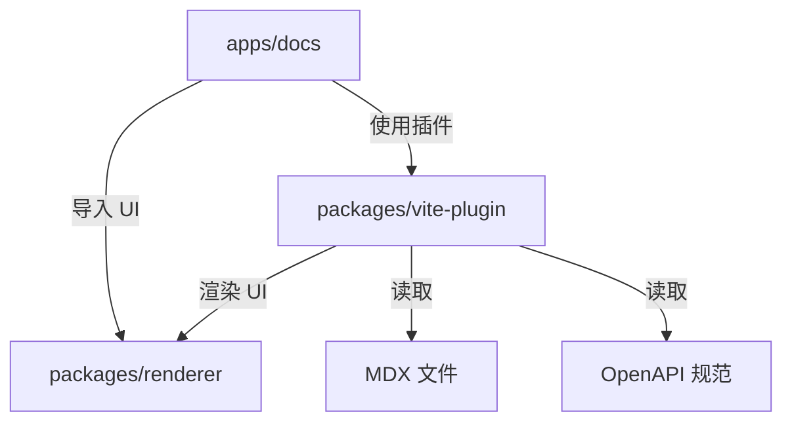

# Clarify 仓库架构

## 概述

Clarify 是一个 monorepo，包含一个为 MDX 和 OpenAPI 优化的开源文档发布工具。仓库在 `apps/` 和 `packages/` 下组织成四个主要工作空间。

## Monorepo 结构

```
├── apps/
│   ├── docs/           # 文档游乐场 & 开发站点 (端口 5173)
│   └── www/            # 营销网站 & 落地页 (端口 5174)
├── packages/
│   ├── renderer/       # 共享 React 组件 & UI 原语
│   └── vite-plugin/    # Clarify 文档引擎的 Vite 插件
```

## 工作空间职责

### `apps/docs` — 文档游乐场
- **用途**：作为主要开发环境和 Clarify 引擎的实时示例。
- **关键特性**：
  - 消费 `@clarify/renderer` 获取 UI 组件。
  - 消费 `@clarify/vite-plugin` 进行 MDX/OpenAPI 编译、路由和开发服务器集成。
  - 为插件和渲染器变更提供真实的测试环境。
- **依赖**：`@clarify/renderer` (workspace), `@clarify/vite-plugin` (workspace)。
- **构建输出**：作为官方文档部署的静态站点。

### `apps/www` — 营销站点
- **用途**：Clarify 项目的公共落地页和营销内容。
- **关键特性**：
  - 独立的 React + Tailwind CSS 应用程序。
  - 展示特性、快速入门指南和社区链接。
- **依赖**：不依赖 `packages/*`（保持独立以简化部署）。
- **构建输出**：部署到项目公共域的静态站点。

### `packages/renderer` — 共享 React 组件
- **用途**：提供文档引擎使用的可复用、主题感知的 React 组件。
- **关键组件**：
  - `DocShell`：文档页面的布局包装器（头部、导航壳）。
  - `ApiEndpointCard`：用于渲染 OpenAPI 端点的视觉组件（方法、路径、描述）。
  - 未来：`Sidebar`、`NavTree`、`CodeBlock`、`SearchModal`、`ThemeToggle`。
- **分发**：使用 `tsup` 构建（ESM + CJS + DTS），以便 Vite（ESM）和其他工具（CJS）都可以消费。
- **约束**：除 React 外必须保持框架无关；不使用 Next.js 或 Vite 特定 API。

### `packages/vite-plugin` — Vite 插件
- **用途**：将 MDX + OpenAPI 转换为可运行文档站点的核心引擎。
- **关键职责**：
  - **MDX 编译**：集成 `@mdx-js/rollup`（或等效工具）将 `.mdx` 文件编译为 React 组件。
  - **OpenAPI 摄取**：读取 `openapi.yaml/json`，使用 `@clarify/renderer` 组件生成类型安全的 API 参考页面。
  - **路由生成**：自动从文件系统生成路由清单（例如 `docs/getting-started.mdx` → `/getting-started`）。
  - **开发服务器**：为 MDX 内容和 API 规范变更提供 HMR。
  - **构建集成**：发出适合部署的静态预渲染站点。
- **配置**：暴露 `ClarifyPluginOptions`（例如 `docsRoot`）进行自定义。
- **分发**：使用 `tsup` 构建（ESM + CJS + DTS）。

## 数据流



1. **作者**在 `apps/docs/content/` 中编写 MDX 文档和 OpenAPI 规范。
2. **`vite-plugin`**扫描内容目录，编译 MDX，摄取 OpenAPI，并生成路由。
3. **`renderer`**组件被编译后的 MDX 和插件生成的页面导入以渲染 UI。
4. **Vite**将所有内容打包为静态站点。

## 依赖规则

- **Apps → Packages**：允许。应用通过 `workspace:*` 依赖包。
- **Packages → Apps**：禁止。包必须保持应用无关。
- **跨包依赖**：在 `package.json` 中使用 `workspace:*`，在开发中使用 Vite `resolve.alias`。
- **外部依赖**：优先选择维护良好、轻量级的库。仅限 React 生态。

## 技术栈

| 层级 | 技术 | 版本 | 理由 |
|-------|-----------|---------|-----------|
| 框架 | React | 19.x | 最新稳定版，并发特性，服务器组件就绪 |
| 样式 | Tailwind CSS | 4.x | 工具优先，最小 CSS 输出，设计系统友好 |
| 构建工具 | Vite | 7.x | 快速 HMR，优化生产构建，出色的插件 API |
| 语言 | TypeScript | 5.x | 严格模式，出色的 DX，类型安全的 MDX/OpenAPI 摄取 |
| 包构建器 | tsup | 8.5.x | 包的快速 ESM/CJS + DTS 构建 |
| 包管理器 | pnpm | 9.x | Workspace 原生，确定性，磁盘高效 |
| Monorepo | pnpm workspaces | - | 简单，快速，无需额外工具 |

## 构建顺序 & 开发工作流

### 开发（无需预构建）
得益于 `apps/docs/vite.config.ts` 中的 Vite 别名，本地包直接从其 `source/` 目录解析。你可以运行：

```bash
pnpm dev:docs   # 启动文档游乐场
pnpm dev:www    # 启动营销站点
```

### 生产构建
包应先构建，然后是应用：

```bash
pnpm build      # 先构建包，然后构建应用 (pnpm --recursive 顺序)
```

由于 `tsup` 输出在 `dist/` 中，生产环境消费者将使用预构建产物。

## 未来扩展

| 工作空间 | 可能的补充 |
|-----------|----------------|
| `packages/` | `@clarify/mdx` — MDX 解析原语（从 vite-plugin 提取） |
| `packages/` | `@clarify/openapi` — OpenAPI 模式类型和转换器 |
| `packages/` | `@clarify/theme` — 主题令牌和 CSS 变量系统 |
| `apps/` | `playground` — 交互式组件沙箱 |
